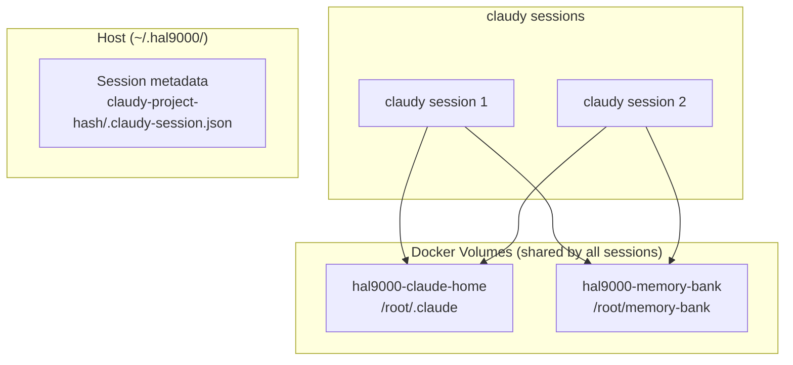

# claudy - Containerized Claude CLI

Quick, frictionless access to Claude inside a containerized development environment.

**Status**: Phase 1 - Core Foundation (Alpha)

## What is claudy?

claudy is a simple wrapper that opens Claude inside a tmux session within a hal-9000 container. No permission dialogs. No complexity. Just `claudy` and you're working.

```bash
$ cd ~/my-project
$ claudy
# Claude opens inside a container with your project mounted
```

## Quick Start

### 1. Prerequisites

- Docker (running)
- bash 4.4+ (macOS, Linux, WSL2)
- hal-9000 Docker images built locally (or will use base)

### 2. Install

```bash
# Clone hal-9000 repository
git clone https://github.com/hellblazer/hal-9000.git
cd hal-9000

# Install claudy
./install-claudy.sh

# Verify installation
claudy --verify
```

### 3. First Use

```bash
# Navigate to your project
cd ~/my-project

# Start Claude in a container
claudy

# That's it! You're now in Claude inside a container
# Your project is mounted at /workspace
```

## Features

### Docker Integration

claudy automatically mounts your Docker daemon socket into the container, allowing you to use `docker` commands as if you were on the host:

```bash
# Inside claudy container
docker build -t my-app .
docker run my-app
docker compose up

# All commands work against your host Docker daemon
```

**Requirements**: Docker daemon running on host
**Security**: Container doesn't have Docker privileges - uses host daemon

### Automatic Project Detection

claudy automatically detects your project type:

- **Java**: Looks for `pom.xml`, `build.gradle`, `build.gradle.kts`
- **Python**: Looks for `pyproject.toml`, `Pipfile`, `requirements.txt`
- **Node.js**: Looks for `package.json`
- **Default**: Uses base profile if nothing detected

```bash
# Auto-detects profile
claudy

# Or force a specific profile
claudy --profile python
```

### Per-Project Session Isolation

Each project gets its own isolated session with:
- Isolated `.claude` directory (config, agents, commands)
- Isolated tmux session
- Deterministic session naming for consistency
- Automatic cleanup of old sessions

### No Permission Dialogs

Because claudy runs inside a container (sandbox), there are no permission popups. The container is the security boundary.

### Persistent Plugins & Configuration

claudy uses Docker volumes to share CLAUDE_HOME across all sessions:
- Plugins installed in any session persist for all sessions
- Settings, agents, commands shared across workers
- No copying or syncing - just shared volumes

```bash
# Install a plugin - it persists across all claudy sessions
claudy plugin install memory-bank
claudy mcp list
```

## Usage

### Basic Commands

```bash
# Start Claude (auto-detect profile)
claudy

# Start Claude with specific profile
claudy --profile java

# Start bash shell instead of Claude
claudy --shell

# Run detached (don't attach to tmux)
claudy --detach

# Custom session name
claudy --name my-session

# Specific directory
claudy ~/projects/myapp
```

### Claude Command Passthrough

Run any `claude` command through claudy - it executes in a container with the shared volume:

```bash
# Plugin management
claudy plugin list                        # List installed plugins
claudy plugin install memory-bank         # Install a plugin
claudy plugin marketplace add <url>       # Add a marketplace

# MCP server management
claudy mcp list                           # List MCP servers
claudy mcp add <server>                   # Add an MCP server

# Health checks
claudy doctor                             # Check Claude health
```

All changes persist in the shared Docker volume (`hal9000-claude-home`).

### DinD Mode (v0.7.0+)

For multi-worker orchestration with shared services:

```bash
# Start the daemon (parent container with ChromaDB)
claudy daemon start

# Spawn workers via parent (shared network namespace)
claudy --via-parent ~/my-project

# Check orchestrator status
claudy daemon status

# Stop orchestrator
claudy daemon stop
```

See `plugins/hal-9000/docker/README-dind.md` for full DinD architecture documentation.

### Help and Diagnostics

```bash
# Show all options
claudy --help

# Check prerequisites (Docker, bash, tmux)
claudy --verify

# Show detailed diagnostics
claudy --diagnose
```

### Environment Variables

**HAL9000_HOME**: Path to claudy session metadata storage

```bash
# Override default session storage location (default: ~/.hal9000)
export HAL9000_HOME=$HOME/.my-hal9000-sessions
claudy
```

**ANTHROPIC_API_KEY**: API key for Claude authentication

```bash
# Set API key for all claudy sessions
export ANTHROPIC_API_KEY=sk-ant-api03-...
claudy
```

### Docker Volumes

claudy uses shared Docker volumes for persistence:

| Volume | Purpose |
|--------|---------|
| `hal9000-claude-home` | CLAUDE_HOME - plugins, settings, agents |
| `hal9000-memory-bank` | Memory bank for cross-session context |

All workers share these volumes, so plugins installed in any session persist everywhere.

## How It Works

### Architecture



### Execution Flow

1. **Detect**: Auto-detect project type from markers
2. **Volumes**: Ensure shared Docker volumes exist
3. **Metadata**: Create session metadata in `~/.hal9000/claude/{session}/`
4. **Launch**: Start container with shared volumes mounted
5. **Mount**: Project directory mounted at /workspace

### Session Naming

Sessions are named deterministically:
```
claudy-{project-name}-{path-hash}
```

This ensures:
- Same project always gets same session name
- No collisions if same project name in different directories
- Easy to identify in `tmux list-sessions`

## Features (Phase 1 - Current)

✅ **Core Foundation**
- Simple bash wrapper
- Auto-profile detection
- Per-project session isolation
- Session-based authentication
- Help and diagnostics

🔄 **Coming Soon (Phase 2-3)**
- Configuration system (.claudyrc)
- Multi-project coordination
- Skills (/wrap, /sup, /fragile)
- Advanced orchestration
- Knowledge storage integration

## Troubleshooting

### "Docker not found"
```bash
# Install Docker
# macOS: brew install docker
# Linux: apt-get install docker.io

# Start Docker daemon
# macOS: open -a Docker
# Linux: systemctl start docker
```

### "No Claude session found"
```bash
# Authenticate Claude
claude /login

# Then run claudy again
claudy
```

### "Container image not found"
```bash
# Build hal-9000 images
cd plugins/hal-9000/docker
./build-profiles.sh

# Then try claudy again
claudy
```

### "Permission denied"
```bash
# Make sure claudy is executable
chmod +x /usr/local/bin/claudy

# Or reinstall
./install-claudy.sh
```

## Architecture

### Why a Container?

- **Isolation**: Your project code runs in sandbox
- **No permissions**: Container is the security boundary
- **Reproducibility**: Same environment every time
- **Flexibility**: Different profiles per project type

### Why tmux?

- **Background management**: Keep sessions alive
- **Reattach**: Return to work later with full state
- **Parallel**: Run multiple projects simultaneously
- **Integration**: Works from IDE terminal or external shell

### Why Simple?

- **Zero configuration**: Works out of the box
- **Frictionless**: Just type `claudy` and go
- **Progressive**: Advanced features available when needed
- **Human control**: Claude doesn't make unilateral decisions

## Development Status

| Phase | Status | Features |
|-------|--------|----------|
| **Phase 1** | ✅ In Progress | Core script, profiles, session management |
| **Phase 2** | 📋 Planned | Configuration, multi-project coordination |
| **Phase 3** | 📋 Planned | Skills, advanced orchestration |

## Contributing

To report issues or suggest improvements:

1. Check [GitHub Issues](https://github.com/hellblazer/hal-9000/issues)
2. For bugs, provide: OS, bash version, error messages
3. For features, link to design documents in `.pm/` directory

## Documentation

- **Installation**: See `install-claudy.sh`
- **Design Details**: See `.pm/CLAUDY_MASTER_INDEX.md` in Memory Bank
- **Architecture**: See `.pm/CLAUDY_DESIGN_SYNTHESIS.md`
- **Authentication**: See `.pm/claudy-authentication-revised.md`

## License

Apache 2.0 - See LICENSE file in repository

---

**Get started**: `cd ~/your-project && claudy`

**Need help?** `claudy --help` or `claudy --diagnose`
