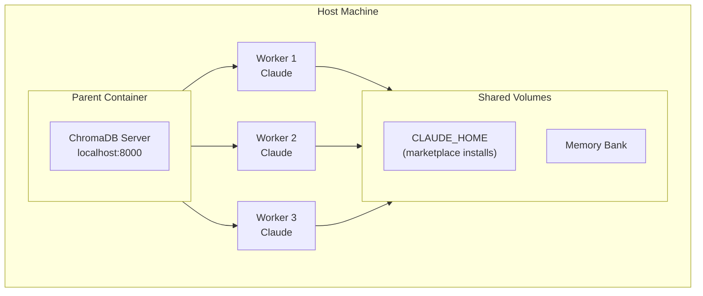

# hal-9000 - Containerized Claude

[](https://github.com/Hellblazer/hal-9000/releases)
[](LICENSE)
[](https://github.com/Hellblazer/hal-9000/pkgs/container/hal-9000)

Run Claude Code in isolated Docker containers with full marketplace support.

## Quick Start

```bash
# Install hal-9000
curl -fsSL https://raw.githubusercontent.com/Hellblazer/hal-9000/main/install-hal-9000.sh | bash

# Login with your Claude subscription (recommended)
hal-9000 /login

# Or use API key instead
export ANTHROPIC_API_KEY=sk-ant-api03-...

# Launch Claude in current directory
hal-9000
```

Auth is stored in a shared Docker volume - login once, use everywhere.

## Marketplace Support

hal-9000 supports Claude Code plugins. Install agents, commands, and tools that persist across all sessions:

```bash
# Add a marketplace (use owner/repo format)
hal-9000 plugin marketplace add anthropics/skills

# Install a plugin
hal-9000 plugin install document-skills

# List installed plugins
hal-9000 plugin list
```

All installations are stored in a persistent Docker volume shared by all workers.

> **Note**: Foundation MCP servers (ChromaDB, Memory Bank, Sequential Thinking) are **pre-installed** in the container - no marketplace installation needed.

## What's Included

Every container provides:

- **Claude CLI** - Native binary, auto-updates
- **Node.js 20 LTS** - For npm-based MCP servers
- **Python + uv** - For Python MCP servers
- **Persistent CLAUDE_HOME** - Marketplace installations persist

**Foundation MCP Servers** (pre-installed):
- **ChromaDB** - Vector database (server in parent, client in workers)
- **Memory Bank** - Persistent memory across sessions (shared volume)
- **Sequential Thinking** - Step-by-step reasoning

Additional MCP servers can be installed via marketplace.

## Usage

### Basic

```bash
hal-9000                     # Launch in current directory
hal-9000 /path/to/project    # Launch in specific directory
hal-9000 --shell             # Start bash instead of Claude
```

### Daemon Management

```bash
hal-9000 daemon start        # Start orchestrator + ChromaDB
hal-9000 daemon status       # Check status
hal-9000 daemon stop         # Stop everything
```

### Worker Pool (Optional)

Pre-warm containers for instant startup:

```bash
hal-9000 pool start          # Start pool manager
hal-9000 pool status         # View warm/busy workers
hal-9000 pool scale 3        # Maintain 3 warm workers
```

## Architecture



- **Parent**: Runs ChromaDB server, manages workers
- **Workers**: Run Claude with marketplace-installed MCP servers
- **CLAUDE_HOME**: Shared volume for all marketplace installations

## Requirements

- Docker
- Bash
- Claude subscription OR `ANTHROPIC_API_KEY`

## Configuration

### Authentication

**Option 1 - Subscription Login (recommended):**
```bash
hal-9000 /login    # Login once, persists in shared volume
```

**Option 2 - API Key:**
```bash
export ANTHROPIC_API_KEY=sk-ant-api03-...
```

### Docker Volumes

hal-9000 uses shared Docker volumes for persistence across sessions:
- `hal9000-claude-home` - CLAUDE_HOME (plugins, settings, agents)
- `hal9000-memory-bank` - Memory bank for cross-session context

### Profiles

```bash
hal-9000 --profile base      # Minimal (default)
hal-9000 --profile python    # + Python tools
hal-9000 --profile node      # + Node.js tools
hal-9000 --profile java      # + Java/Maven tools
```

## Companion Tools

### hal-9000 Plugin - Agents & Commands

Custom agents, slash commands, and hooks for enhanced Claude workflows:

```bash
# Install the plugin
hal-9000 plugin marketplace add Hellblazer/hal-9000
hal-9000 plugin install hal-9000
```

**Includes**:
- 12 specialized agents (java-developer, code-review-expert, strategic-planner, etc.)
- Slash commands (/check, /load, /sessions)
- Safety hooks

[hal-9000 documentation →](plugins/hal-9000/README.md)

### beads (bd) - Issue Tracking

AI-optimized issue tracker with dependency support:

```bash
bd init                           # Initialize in project
bd create "Task" -t feature -p 1  # Create issue
bd ready                          # Show unblocked work
bd close <id>                     # Complete issue
```

[beads documentation →](plugins/hal-9000/mcp-servers/beads/README.md)

### aod - Multi-Branch Development

Parallel development across git branches:

```bash
aod-init                 # Generate config
aod aod.yml              # Launch all branches
aod-list                 # Show sessions
aod-broadcast "cmd"      # Send to all
```

[aod documentation →](plugins/hal-9000/aod/README.md)

## Troubleshooting

```bash
hal-9000 --diagnose              # Show diagnostic info
hal-9000 daemon status           # Check daemon health
docker logs hal9000-parent     # View parent logs
```

### Common Issues

**"Parent container not running"**
```bash
hal-9000 daemon start
```

**"Cannot connect to Docker"**
```bash
# Ensure Docker is running
docker ps
```

**"ChromaDB not responding"**
```bash
hal-9000 daemon restart
```

## Documentation

- [Architecture Details](plugins/hal-9000/docs/dind/ARCHITECTURE.md)
- [Configuration Reference](plugins/hal-9000/docs/dind/CONFIGURATION.md)
- [Troubleshooting Guide](plugins/hal-9000/docs/dind/TROUBLESHOOTING.md)
- [Development Guide](plugins/hal-9000/docs/dind/DEVELOPMENT.md)

## License

Apache 2.0
