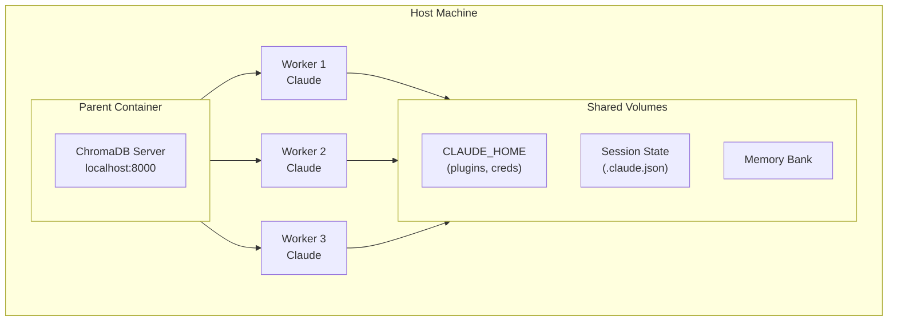

# hal-9000 - Containerized Claude

[](https://github.com/Hellblazer/hal-9000/releases)
[](LICENSE)
[](https://github.com/Hellblazer/hal-9000/pkgs/container/hal-9000)

Run Claude Code in isolated Docker containers with full marketplace support.

## Quick Start

```bash
# Install hal-9000
curl -fsSL https://raw.githubusercontent.com/Hellblazer/hal-9000/main/install-hal-9000.sh | bash

# Login with your Claude subscription (recommended)
hal-9000 /login

# Or use API key instead
export ANTHROPIC_API_KEY=sk-ant-api03-...

# Launch Claude in current directory
hal-9000
```

Auth is stored in a shared Docker volume - login once, use everywhere.

## Security Improvements (v1.5.0)

hal-9000 v1.5.0 includes **2 critical security fixes**:
- **Code Injection via Config File** - Replaced unsafe `source` command with safe parsing
- **Path Traversal in Local Profiles** - Added validation to prevent `../` attacks in profile names

All fixes validated with **30/30 tests passing**. [Read detailed security summary →](SECURITY_FIX_SUMMARY.md)

## Marketplace Support

hal-9000 supports Claude Code plugins. Install agents, commands, and tools that persist across all sessions:

```bash
# Add a marketplace (use owner/repo format)
hal-9000 plugin marketplace add anthropics/skills

# Install a plugin
hal-9000 plugin install document-skills

# List installed plugins
hal-9000 plugin list
```

All installations are stored in a persistent Docker volume shared by all workers.

> **Note**: Foundation MCP servers (ChromaDB, Memory Bank) require one-time setup via `scripts/setup-foundation-mcp.sh` on your host machine. Sequential Thinking is pre-installed in all workers. See [Foundation MCP Servers Setup](#foundation-mcp-servers-setup) below.

## What's Included

Every container provides:

- **Claude CLI** - Native binary, auto-updates
- **Node.js 20 LTS** - For npm-based MCP servers
- **Python + uv** - For Python MCP servers
- **Persistent CLAUDE_HOME** - Marketplace installations persist

**Foundation MCP Servers** (available via setup script):
- **ChromaDB** - Vector database server (requires setup via `scripts/setup-foundation-mcp.sh`)
- **Memory Bank** - Persistent memory across sessions (requires setup)
- **Sequential Thinking** - Step-by-step reasoning (pre-installed in workers)

Additional MCP servers can be installed via marketplace.

### MCP Configuration Persistence

MCP server configurations are automatically persisted across all hal-9000 sessions:

```bash
# Session 1: Add a custom MCP server
hal-9000 /path/to/project1
# Inside Claude:
# hal-9000 mcp add my-custom-server

# Exit and start a new session
hal-9000 /path/to/project2

# MCP configuration from session 1 is automatically available
# No need to re-register servers in each session
```

**What persists:**
- All MCP server registrations and configurations
- Custom MCP server settings and parameters
- Tool search preferences and exclusions
- Feature flag state
- Performance tuning settings

**Why this matters:**
- Set up MCP servers once, use everywhere
- Consistent Claude environment across all projects
- No configuration drift between sessions
- Faster startup (no reconfiguration needed)

## Foundation MCP Servers Setup

Foundation MCP Servers (ChromaDB and Memory Bank) run at the host level, accessible to all worker containers. One-time setup is required after installing hal-9000:

```bash
~/.hal9000/scripts/setup-foundation-mcp.sh              # Full setup
~/.hal9000/scripts/setup-foundation-mcp.sh --status     # Check status
```

### What Gets Deployed

**ChromaDB** - Vector database for semantic search and embeddings
- Runs as Docker container on port 8000 (configurable)
- Persistent local storage at `~/.hal9000/foundation-mcp/chromadb-data/`
- Automatically restarts if stopped

**Memory Bank** - Persistent memory across sessions
- File-based storage at `~/.hal9000/foundation-mcp/memory-bank-data/`
- Shared with all worker containers
- Use for storing context, research findings, and persistent state

**Sequential Thinking** - Step-by-step reasoning
- Pre-installed as MCP server in all workers
- Available immediately after setup script completes

### Setup Script Commands

```bash
# Full setup (creates directories, deploys ChromaDB, initializes Memory Bank)
~/.hal9000/scripts/setup-foundation-mcp.sh

# Customize ChromaDB port
~/.hal9000/scripts/setup-foundation-mcp.sh --chromadb-port 8001

# Check service status
~/.hal9000/scripts/setup-foundation-mcp.sh --status

# View logs
~/.hal9000/scripts/setup-foundation-mcp.sh --logs chromadb        # ChromaDB logs
~/.hal9000/scripts/setup-foundation-mcp.sh --logs memory-bank     # Memory Bank info
~/.hal9000/scripts/setup-foundation-mcp.sh --logs all             # All services

# Manage services
~/.hal9000/scripts/setup-foundation-mcp.sh --start                # Start services
~/.hal9000/scripts/setup-foundation-mcp.sh --stop                 # Stop services

# Remove everything (destructive)
~/.hal9000/scripts/setup-foundation-mcp.sh --cleanup
```

### Verification

After setup, verify services are accessible:

```bash
# Check ChromaDB is responding
curl http://localhost:8000/api/v1/heartbeat

# Check Memory Bank storage
ls ~/.hal9000/foundation-mcp/memory-bank-data/
```

## Usage

### Basic

```bash
hal-9000                     # Launch in current directory
hal-9000 /path/to/project    # Launch in specific directory
hal-9000 --shell             # Start bash instead of Claude
```

### Daemon Management

```bash
hal-9000 daemon start        # Start orchestrator + ChromaDB
hal-9000 daemon status       # Check status
hal-9000 daemon stop         # Stop everything
```

### Worker Pool (Optional)

Pre-warm containers for instant startup:

```bash
hal-9000 pool start          # Start pool manager
hal-9000 pool status         # View warm/busy workers
hal-9000 pool scale 3        # Maintain 3 warm workers
```

## Architecture



- **Parent**: Runs ChromaDB server, manages workers
- **Workers**: Run Claude with marketplace-installed MCP servers
- **CLAUDE_HOME**: Shared volume for plugins, credentials, and settings
- **Session State**: Shared volume for `.claude.json` (authentication, MCP config)

## Requirements

- Docker
- Bash
- Claude subscription OR `ANTHROPIC_API_KEY`

## Configuration

### Authentication

**Option 1 - Subscription Login (recommended):**
```bash
hal-9000 /login    # Login once, persists in shared volume
```

**Option 2 - API Key:**
```bash
export ANTHROPIC_API_KEY=sk-ant-api03-...
```

### Session State Persistence

hal-9000 maintains full state across container instances using shared volumes:

- **`hal9000-claude-home`** - CLAUDE_HOME directory
  - Marketplace plugins and commands
  - User settings and preferences
  - MCP server registrations
  - Installed skills and agents
  - Complete credentials (from `/login`)

- **`hal9000-claude-session`** - Claude session state (`.claude.json`)
  - **Critical**: Authentication token and expiration
  - **Critical**: MCP server configurations
  - Feature flags and experimental features
  - Tool search preferences
  - User identity and metadata

- **`hal9000-memory-bank`** - Memory bank for cross-session context
  - Persistent structured memory across sessions
  - Available to all Claude processes

**Key Benefit**: MCP configurations registered in one session are automatically available in all subsequent sessions.

### Profiles

Built-in profiles are automatically selected based on your project structure:

```bash
hal-9000 --profile base      # Minimal (default)
hal-9000 --profile python    # + Python tools
hal-9000 --profile node      # + Node.js tools
hal-9000 --profile java      # + Java/Maven tools
```

**Auto-Detection:**
- Python: Detects `requirements.txt`, `pyproject.toml`, `Pipfile`
- Node.js: Detects `package.json`
- Java: Detects `pom.xml`, `build.gradle`, `build.gradle.kts`

**Creating Custom Profiles:**

Want a Ruby profile? Go profile? Anything else? You can create custom profiles for any language/framework.

**Quick Start (easiest):** See [Local Profiles Quick Start](README-LOCAL_PROFILES.md)
- Create a Dockerfile in `~/.hal9000/profiles/{name}/`
- hal-9000 auto-detects and builds it
- Zero setup, no repo cloning needed

**Complete Guide:** See [Custom Profiles Guide](README-CUSTOM_PROFILES.md) for:
- Complete walkthrough of creating a new profile
- Examples: Ruby, Go, Rust, PHP, .NET
- Best practices and troubleshooting
- How to share profiles with the community
- Contributing profiles back to the project

## Companion Tools

### hal-9000 Plugin - Agents & Commands

Custom agents, slash commands, and hooks for enhanced Claude workflows:

```bash
# Install the plugin
hal-9000 plugin marketplace add Hellblazer/hal-9000
hal-9000 plugin install hal-9000
```

**Includes**:
- 16 specialized agents (java-developer, code-review-expert, strategic-planner, etc.)
- Slash commands (/check, /load, /sessions)
- Safety hooks

[hal-9000 documentation →](plugins/hal-9000/README.md)

### beads (bd) - Issue Tracking

AI-optimized issue tracker with dependency support:

```bash
bd init                           # Initialize in project
bd create "Task" -t feature -p 1  # Create issue
bd ready                          # Show unblocked work
bd close <id>                     # Complete issue
```

[beads documentation →](plugins/hal-9000/mcp-servers/beads/README.md)

### aod - Multi-Branch Development

Parallel development across git branches:

```bash
aod-init                 # Generate config
aod aod.yml              # Launch all branches
aod-list                 # Show sessions
aod-broadcast "cmd"      # Send to all
```

[aod documentation →](plugins/hal-9000/aod/README.md)

## Troubleshooting

```bash
hal-9000 --diagnose              # Show diagnostic info
hal-9000 daemon status           # Check daemon health
docker logs hal9000-parent     # View parent logs
```

### Common Issues

**"Parent container not running"**
```bash
hal-9000 daemon start
```

**"Cannot connect to Docker"**
```bash
# Ensure Docker is running
docker ps
```

**"ChromaDB not responding"**
```bash
hal-9000 daemon restart
```

## Documentation

- [Architecture Details](plugins/hal-9000/docs/dind/ARCHITECTURE.md)
- [Configuration Reference](plugins/hal-9000/docs/dind/CONFIGURATION.md)
- [Troubleshooting Guide](plugins/hal-9000/docs/dind/TROUBLESHOOTING.md)
- [Development Guide](plugins/hal-9000/docs/dind/DEVELOPMENT.md)
- [Custom Profiles Guide](README-CUSTOM_PROFILES.md) - Create your own specialized profiles (Ruby, Go, Rust, PHP, etc.)

## License

Apache 2.0
