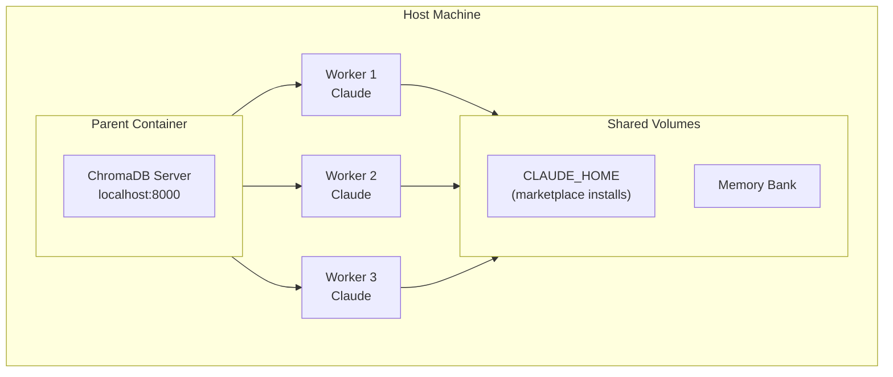

# claudy - Containerized Claude

[](https://github.com/Hellblazer/hal-9000/releases)
[](LICENSE)
[](https://github.com/Hellblazer/hal-9000/pkgs/container/hal-9000)

Run Claude Code in isolated Docker containers with full marketplace support.

## Quick Start

```bash
# Install claudy
curl -fsSL https://raw.githubusercontent.com/Hellblazer/hal-9000/main/install-claudy.sh | bash

# Set API key
export ANTHROPIC_API_KEY=sk-ant-api03-...

# Start the daemon (first time)
claudy daemon start

# Launch Claude in current directory
claudy
```

## Marketplace Support

claudy provides first-class support for the Anthropic Claude Code marketplace. Install MCP servers, agents, and commands that persist across all sessions:

```bash
# Add a marketplace
claude plugin marketplace add https://github.com/example/my-marketplace

# Install plugins
claude plugin install memory-bank
claude plugin install chromadb

# List installed plugins
claude plugin list
```

All installations are stored in a persistent `CLAUDE_HOME` volume shared by all workers.

## What's Included

Every container provides:

- **Claude CLI** - Native binary, auto-updates
- **Node.js 20 LTS** - For npm-based MCP servers
- **Python + uv** - For Python MCP servers
- **Persistent CLAUDE_HOME** - Marketplace installations persist

**Foundation MCP Servers** (pre-installed):
- **ChromaDB** - Vector database (server in parent, client in workers)
- **Memory Bank** - Persistent memory across sessions (shared volume)
- **Sequential Thinking** - Step-by-step reasoning

Additional MCP servers can be installed via marketplace.

## Usage

### Basic

```bash
claudy                     # Launch in current directory
claudy /path/to/project    # Launch in specific directory
claudy --shell             # Start bash instead of Claude
```

### Daemon Management

```bash
claudy daemon start        # Start orchestrator + ChromaDB
claudy daemon status       # Check status
claudy daemon stop         # Stop everything
```

### Worker Pool (Optional)

Pre-warm containers for instant startup:

```bash
claudy pool start          # Start pool manager
claudy pool status         # View warm/busy workers
claudy pool scale 3        # Maintain 3 warm workers
```

## Architecture



- **Parent**: Runs ChromaDB server, manages workers
- **Workers**: Run Claude with marketplace-installed MCP servers
- **CLAUDE_HOME**: Shared volume for all marketplace installations

## Requirements

- Docker
- Bash
- `ANTHROPIC_API_KEY` environment variable

## Configuration

### Environment Variables

```bash
export ANTHROPIC_API_KEY=sk-ant-api03-...  # Required for API access
```

### Docker Volumes

claudy uses shared Docker volumes for persistence across sessions:
- `hal9000-claude-home` - CLAUDE_HOME (plugins, settings, agents)
- `hal9000-memory-bank` - Memory bank for cross-session context

### Profiles

```bash
claudy --profile base      # Minimal (default)
claudy --profile python    # + Python tools
claudy --profile node      # + Node.js tools
claudy --profile java      # + Java/Maven tools
```

## Companion Tools

### beads (bd) - Issue Tracking

AI-optimized issue tracker with dependency support:

```bash
bd init                           # Initialize in project
bd create "Task" -t feature -p 1  # Create issue
bd ready                          # Show unblocked work
bd close <id>                     # Complete issue
```

[beads documentation →](plugins/hal-9000/mcp-servers/beads/README.md)

### aod - Multi-Branch Development

Parallel development across git branches:

```bash
aod-init                 # Generate config
aod aod.yml              # Launch all branches
aod-list                 # Show sessions
aod-broadcast "cmd"      # Send to all
```

[aod documentation →](plugins/hal-9000/aod/README.md)

## Troubleshooting

```bash
claudy --diagnose              # Show diagnostic info
claudy daemon status           # Check daemon health
docker logs hal9000-parent     # View parent logs
```

### Common Issues

**"Parent container not running"**
```bash
claudy daemon start
```

**"Cannot connect to Docker"**
```bash
# Ensure Docker is running
docker ps
```

**"ChromaDB not responding"**
```bash
claudy daemon restart
```

## Documentation

- [Architecture Details](plugins/hal-9000/docs/dind/ARCHITECTURE.md)
- [Configuration Reference](plugins/hal-9000/docs/dind/CONFIGURATION.md)
- [Troubleshooting Guide](plugins/hal-9000/docs/dind/TROUBLESHOOTING.md)
- [Development Guide](plugins/hal-9000/docs/dind/DEVELOPMENT.md)

## License

Apache 2.0
