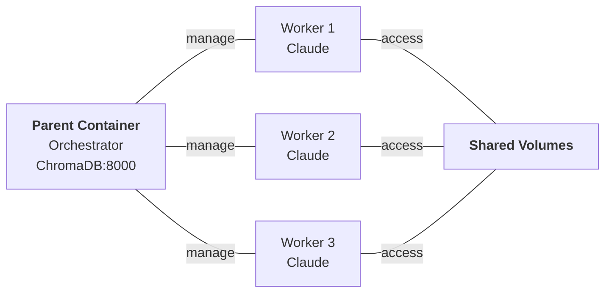

# hal-9000 - Containerized Claude

[](https://github.com/Hellblazer/hal-9000/releases)
[](LICENSE)
[](https://github.com/Hellblazer/hal-9000/pkgs/container/hal-9000)

Run Claude Code in isolated Docker containers with Docker-in-Docker orchestration, persistent session state, and full marketplace support.

## Quick Start

```bash
# Install hal-9000
curl -fsSL https://raw.githubusercontent.com/Hellblazer/hal-9000/main/install-hal-9000.sh | bash

# Login with your Claude subscription (recommended)
hal-9000 /login

# Or use API key instead
export ANTHROPIC_API_KEY=sk-ant-api03-...

# Launch Claude in current directory
hal-9000
```

Auth is stored in a shared Docker volume - login once, use everywhere.

## Security

hal-9000 includes comprehensive security hardening:
- **Code Injection Prevention** - Safe config file parsing (no arbitrary code execution)
- **Path Traversal Prevention** - Profile name validation blocks `../` attacks
- **30/30 security tests passing** - Automated validation for all security features

[Read detailed security summary →](SECURITY.md)

## Marketplace Support

hal-9000 supports Claude Code plugins. Install agents, commands, and tools that persist across all sessions:

```bash
# Add a marketplace (use owner/repo format)
hal-9000 plugin marketplace add anthropics/skills

# Install a plugin
hal-9000 plugin install document-skills

# List installed plugins
hal-9000 plugin list
```

All installations are stored in a persistent Docker volume shared by all workers.

> **Note**: Foundation MCP servers (ChromaDB, Memory Bank) require one-time setup via `scripts/setup-foundation-mcp.sh` on your host machine. Sequential Thinking is pre-installed in all workers. See [Foundation MCP Servers Setup](#foundation-mcp-servers-setup) below.

## What's Included

Every container includes:

- **Claude CLI** - Native binary, auto-updates
- **Node.js 20 LTS** - For npm-based tools and marketplace plugins
- **Python + uv** - For Python-based tools and marketplace plugins
- **Persistent plugins and settings** - Installed via marketplace, survive across sessions

**Foundation MCP Servers** (host-level, one-time setup):
- **ChromaDB** - Vector database for semantic search and embeddings
- **Memory Bank** - Cross-session persistent memory shared across all workers
- **Sequential Thinking** - Step-by-step reasoning (pre-installed in all workers)

MCP server configurations persist across all sessions. Register once, use everywhere.

## Foundation MCP Servers

**What are Foundation MCP Servers?**
MCP (Model Context Protocol) servers extend Claude's capabilities by providing tools and knowledge access. hal-9000 includes three core Foundation MCP servers:

- **ChromaDB** - Vector database for semantic search
- **Memory Bank** - Cross-session persistent memory
- **Sequential Thinking** - Step-by-step reasoning

These are set up once at the host level via `setup-foundation-mcp.sh` and automatically available to all workers.

## Foundation MCP Servers Setup

Foundation MCP Servers run at the host level, accessible to all workers. One-time setup after installing hal-9000:

```bash
~/.hal9000/scripts/setup-foundation-mcp.sh
```

This deploys:
- **ChromaDB** (port 8000) - Vector database for semantic search
- **Memory Bank** - Persistent storage for cross-session context
- **Sequential Thinking** - Step-by-step reasoning (pre-installed in workers)

Check status and manage services:
```bash
~/.hal9000/scripts/setup-foundation-mcp.sh --status    # Check status
~/.hal9000/scripts/setup-foundation-mcp.sh --logs      # View logs
```

See [Foundation MCP Servers documentation](plugins/hal-9000/docs/dind/CONFIGURATION.md) for advanced configuration and troubleshooting.

## Usage

### Basic

```bash
hal-9000                     # Launch in current directory
hal-9000 /path/to/project    # Launch in specific directory
hal-9000 --shell             # Start bash instead of Claude
```

### Daemon Management

```bash
hal-9000 daemon start        # Start orchestrator + ChromaDB
hal-9000 daemon status       # Check status
hal-9000 daemon stop         # Stop everything
```

### Worker Pool (Optional)

Pre-warm containers for instant startup:

```bash
hal-9000 pool start          # Start pool manager
hal-9000 pool status         # View warm/busy workers
hal-9000 pool scale 3        # Maintain 3 warm workers
```

## Architecture



- **Parent**: Runs ChromaDB server, manages workers
- **Workers**: Run Claude with marketplace-installed MCP servers
- **CLAUDE_HOME**: Shared volume for plugins, credentials, and settings
- **Session State**: Shared volume for `.claude.json` (authentication, MCP config)

## Requirements

- Docker
- Bash
- Claude subscription OR `ANTHROPIC_API_KEY`

## Configuration

### Authentication

**Option 1 - Subscription Login (recommended):**
```bash
hal-9000 /login    # Login once, persists in shared volume
```

**Option 2 - API Key:**
```bash
export ANTHROPIC_API_KEY=sk-ant-api03-...
```

### Session State Persistence

hal-9000 maintains state across container instances using shared volumes:

- **`hal9000-claude-home`** - Marketplace plugins, credentials, MCP configurations
- **`hal9000-claude-session`** - Authentication tokens, session settings
- **`hal9000-memory-bank`** - Cross-session persistent memory

Set up MCP servers once—credentials and configurations persist across all sessions automatically.

### Profiles

Built-in profiles are automatically selected based on your project structure:

```bash
hal-9000 --profile base      # Minimal (default)
hal-9000 --profile python    # + Python tools
hal-9000 --profile node      # + Node.js tools
hal-9000 --profile java      # + Java/Maven tools
```

**Auto-Detection:**
- Python: Detects `requirements.txt`, `pyproject.toml`, `Pipfile`
- Node.js: Detects `package.json`
- Java: Detects `pom.xml`, `build.gradle`, `build.gradle.kts`

**Creating Custom Profiles:**

Want a Ruby profile? Go profile? Anything else? You can create custom profiles for any language/framework.

**Quick Start (easiest):** See [Local Profiles Quick Start](README-LOCAL_PROFILES.md)
- Create a Dockerfile in `~/.hal9000/profiles/{name}/`
- hal-9000 auto-detects and builds it
- Zero setup, no repo cloning needed

**Complete Guide:** See [Custom Profiles Guide](README-CUSTOM_PROFILES.md) for:
- Complete walkthrough of creating a new profile
- Examples: Ruby, Go, Rust, PHP, .NET
- Best practices and troubleshooting
- How to share profiles with the community
- Contributing profiles back to the project

## Companion Tools

### hal-9000 Plugin - Tools & Commands

Custom commands, MCP servers, and hooks for enhanced Claude workflows:

```bash
# Install the plugin
hal-9000 plugin marketplace add Hellblazer/hal-9000
hal-9000 plugin install hal-9000
```

**Includes**:
- Slash commands (/check, /load, /sessions)
- MCP servers and integrations
- Safety hooks

[hal-9000 documentation →](plugins/hal-9000/README.md)

### aod - Multi-Branch Development

Parallel development across git branches:

```bash
aod-init                 # Generate config
aod aod.yml              # Launch all branches
aod-list                 # Show sessions
aod-broadcast "cmd"      # Send to all
```

[aod documentation →](plugins/hal-9000/aod/README.md)

## Troubleshooting

```bash
hal-9000 --diagnose              # Show diagnostic info
hal-9000 daemon status           # Check daemon health
docker logs hal9000-parent     # View parent logs
```

### Common Issues

**"Parent container not running"**
```bash
hal-9000 daemon start
```

**"Cannot connect to Docker"**
```bash
# Ensure Docker is running
docker ps
```

**"ChromaDB not responding"**
```bash
hal-9000 daemon restart
```

## Documentation

- [Architecture Details](plugins/hal-9000/docs/dind/ARCHITECTURE.md)
- [Configuration Reference](plugins/hal-9000/docs/dind/CONFIGURATION.md)
- [Troubleshooting Guide](plugins/hal-9000/docs/dind/TROUBLESHOOTING.md)
- [Development Guide](plugins/hal-9000/docs/dind/DEVELOPMENT.md)
- [Custom Profiles Guide](README-CUSTOM_PROFILES.md) - Create your own specialized profiles (Ruby, Go, Rust, PHP, etc.)

## License

Apache 2.0
