# aod (Army of Darkness)

Multi-branch parallel development using Docker containers with git worktrees and tmux sessions.

## Overview

aod (Army of Darkness) orchestrates multiple isolated development environments simultaneously. Each environment consists of a git worktree, tmux session, and Docker container running the hal-9000 image. This enables working on different branches in parallel without switching contexts or losing state.

Inspired by claude-squad's multi-session workflow concept, aod is an independent implementation using bash scripting, tmux, and Docker containers. Each branch runs in complete isolation with its own container, filesystem state, and terminal session.

**v1.3.0:** Containers now include pre-installed MCP servers (Memory Bank, ChromaDB, Sequential Thinking) with automatic configuration. Zero manual setup required.

## Architecture


**Components:**
- **Git Worktrees** - Independent checkouts sharing one .git directory
- **Tmux Sessions** - Persistent terminals that survive disconnections
- **hal-9000 Containers** - Docker containers with Claude CLI and pre-installed MCP servers
- **Slot System** - Auto-assigned unique identifiers preventing port conflicts
- **Session Context** - Auto-generated `CLAUDE.md` in each worktree with session info
- **Shared Memory Bank** - Host's `~/memory-bank` mounted for cross-container data sharing

**v1.3.0 Container Architecture:**

```mermaid
graph TB
    subgraph Container["hal-9000 Container (ghcr.io/hellblazer/hal-9000:worker)"]
        subgraph Runtime["Runtime"]
            CLI["Claude CLI"]
            MCP["MCP Servers:<br/>memory-bank, sequential-thinking, chroma-mcp"]
        end

        subgraph Mounts["Volume Mounts"]
            WS["/workspace ← git worktree"]
            CC["/root/.claude ← hal9000-claude-home volume"]
            MB["/data/memory-bank ← hal9000-memory-bank volume"]
        end
    end
```



## Prerequisites

- git (version control)
- tmux (terminal multiplexer)
- docker (container runtime, must be running)

The hal-9000 installer adds aod scripts to PATH automatically.

## Quick Start

### 1. Create Configuration

Create a `aod.conf` file defining branches and tasks:

```conf
# Format: branch:profile:description
feature/auth:python:Add OAuth2 authentication
feature/api:node:Build REST API endpoints
bugfix/validation:python:Fix input validation
```

Copy the example to start:
```bash
cp aod.conf.example aod.conf
```

### 2. Launch Sessions

```bash
aod aod.conf
```

This creates:
- Git worktrees in `~/.aod/worktrees/`
- Tmux sessions named `aod-{branch}`
- hal-9000 containers with unique slot numbers
- Session metadata in `~/.aod/sessions.log`

### 3. Work with Sessions

**List active sessions:**
```bash
aod-list
```

**Attach to specific session:**
```bash
aod-attach aod-feature-auth
```

Detach with `Ctrl+b` then `d`.

**Stop single session:**
```bash
aod-stop aod-feature-auth
```

**Send command to session:**
```bash
aod-send aod-feature-auth "git status"
```

**Broadcast to all sessions:**
```bash
aod-broadcast "git fetch"
```

**Cleanup everything:**
```bash
aod-cleanup
```

Cleanup removes all sessions, containers, worktrees, and state.

## Configuration Format

`aod.conf` uses colon-separated fields:

```
branch:profile:description
```

| Field | Required | Description |
|-------|----------|-------------|
| `branch` | Yes | Git branch name (created from HEAD if missing) |
| `profile` | No | Language profile(s), comma-separated (python, node, java) |
| `description` | No | Task description for reference |

### Examples

```conf
# Branch only (uses default profile)
feature/quick-fix::

# Branch with profile
feature/api:node:

# Full specification
feature/auth:python:Add OAuth2 authentication system

# Multiple profiles
feature/fullstack:python,node:Full-stack feature

# Comments and blank lines ignored
```

## How It Works

### Git Worktrees

Git worktrees allow multiple branches checked out simultaneously. Each worktree is an independent working directory sharing the `.git` database.

Location: `~/.aod/worktrees/`

```
~/.aod/worktrees/
├── myproject-feature-auth/      # feature/auth branch
├── myproject-feature-api/       # feature/api branch
└── myproject-bugfix-validation/ # bugfix/validation branch
```

Changes in one worktree don't affect others. Each has its own uncommitted changes, build artifacts, and file state.

### Tmux Sessions

Each worktree runs in a tmux session for persistent access.

Session naming: `aod-{branch-name-with-slashes-replaced}`

```bash
tmux list-sessions
# aod-feature-auth: 1 windows
# aod-feature-api: 1 windows
# aod-bugfix-validation: 1 windows
```

Sessions persist across terminal disconnections. Attach and detach freely without losing state.

### hal-9000 Containers

Each session runs a hal-9000 container with:
- Auto-assigned slot number (prevents port conflicts)
- Pre-installed Claude CLI and MCP servers
- Specified language profile (python, node, etc.)
- Isolated filesystem and network
- Unique container name
- Auto-configured MCP servers (Memory Bank, ChromaDB, Sequential Thinking)

```bash
docker ps
# aod-myproject-abc123-slot1  # feature/auth
# aod-myproject-def456-slot2  # feature/api
# aod-myproject-ghi789-slot3  # bugfix/validation
```

Containers mount the host's `~/.claudebox/hal-9000` directory for agents and tools, plus `~/memory-bank` for shared Memory Bank access across containers.

**v1.3.0 Features:**
- MCP servers pre-installed in Docker image (no download delay)
- Auto-configured on container startup
- Shared Memory Bank for cross-container coordination
- ChromaDB supports ephemeral or cloud mode (auto-detected from env vars)

### State Tracking

Session metadata stored as JSON in `~/.aod/sessions.log`:

```json
{
  "session": "aod-feature-auth",
  "branch": "feature/auth",
  "worktree": "/home/user/.aod/worktrees/myproject-feature-auth",
  "slot": 1,
  "profile": "python",
  "created": "2025-12-13T10:30:00-0800"
}
```

Used by aod-list and aod-cleanup to track active sessions.

### Session Context (CLAUDE.md)

Each worktree automatically gets a `CLAUDE.md` file with session-specific context.

**Location:** `~/.aod/worktrees/{repo}-{branch}/CLAUDE.md`

**Contents:**
- Current session name, branch, and worktree path
- List of other active aod sessions
- Available aod commands with examples
- Common workflows for coordination

**Purpose:** When Claude Code runs in an aod session (via ClaudeBox), it reads the CLAUDE.md and knows:
- Which session it's running in
- What other sessions are available
- How to coordinate across sessions using aod-send/aod-broadcast

**Example usage:**
- Claude automatically suggests using `aod-broadcast` for operations affecting all branches
- Claude can tell you which other sessions are active
- Claude understands session isolation and worktree structure

**Note:** The CLAUDE.md is created when the session launches and shows other sessions active at that time. For current session list, use `aod-list`.

## Command Reference

### aod

Launch sessions from configuration file.

```bash
aod [config_file]

# Uses aod.conf by default
aod

# Custom config file
aod my-tasks.conf
```

Creates worktrees, tmux sessions, and containers. Skips existing sessions.

### aod-list

List all active aod sessions and containers.

```bash
aod-list
```

Output shows:
- Tmux sessions and status
- Running containers
- Available commands

### aod-attach

Attach to specific session.

```bash
aod-attach <session-name>

# Example
aod-attach aod-feature-auth
```

Enters the tmux session. Detach with `Ctrl+b` then `d`.

### aod-stop

Stop specific session, keep worktree.

```bash
aod-stop <session-name>

# Example
aod-stop aod-feature-auth
```

Kills tmux session and container. Worktree remains for manual inspection or later use.

### aod-send

Send command to specific session without attaching.

```bash
aod-send <session-name> <command>

# Examples
aod-send aod-feature-auth "git status"
aod-send aod-feature-api "./mvnw test"
```

Uses tmux-cli to send commands. Eliminates manual pane ID lookup.

### aod-broadcast

Send command to all aod sessions simultaneously.

```bash
aod-broadcast <command>

# Examples
aod-broadcast "git fetch"
aod-broadcast "./mvnw clean"
```

Useful for batch operations across all parallel work streams.

### aod-cleanup

Stop all sessions and remove all worktrees.

```bash
aod-cleanup
```

Prompts for confirmation before:
- Killing all aod tmux sessions
- Removing all ClaudeBox containers
- Removing all git worktrees
- Cleaning state directory

Destructive operation. Use aod-stop for selective cleanup.

## Use Cases

### Parallel Feature Development

```conf
feature/user-auth:python:Implement user authentication
feature/payment:node:Add payment processing
feature/notifications:python:Build notification system
```

Work on multiple features simultaneously. Each in isolated environment with appropriate tooling.

### Code Review

```conf
review/pr-123:python:Review authentication PR
review/pr-124:node:Review API changes PR
review/pr-125:python:Review database migration PR
```

Launch multiple PRs for review. Switch between them without losing context or checkout state.

### Bug Triage

```conf
P0/crash-on-login:python:Critical login crash
P0/data-corruption:python:Critical data loss bug
P1/slow-query:python:Performance issue
P1/ui-glitch:node:UI rendering problem
```

Investigate multiple bugs in parallel. Prioritize by switching sessions rather than branches.

### Experimentation

```conf
experiment/approach-a:python:Try SQLAlchemy ORM
experiment/approach-b:python:Try raw SQL queries
experiment/approach-c:python:Try async DB driver
```

Test different approaches simultaneously. Compare results without destroying previous work.

### Refactoring

```conf
refactor/models:python:Refactor database models
refactor/views:python:Refactor API views
refactor/tests:python:Update test suite
refactor/docs::Update documentation
```

Large refactoring split into parallel tracks. Each progresses independently.

## Best Practices

### Descriptive Branch Names

Use clear, hierarchical branch names:

```conf
# Good
feature/oauth2-authentication:python:Add OAuth2 support
bugfix/null-pointer-login:python:Fix NPE in login handler

# Avoid
feat1::
fix::
temp::
```

Branch names become session names and container identifiers.

### Match Profiles to Tasks

```conf
# Backend work
api/endpoints:python:

# Frontend work
ui/components:node:

# Full-stack
feature/end-to-end:python,node:

# No profile needed for docs
docs/api-reference::
```

Profiles install language tooling. Omit when not needed.

### Session Management

Check status frequently:
```bash
aod-list
```

Stop unused sessions to free resources:
```bash
aod-stop aod-feature-name
```

Full cleanup when switching contexts:
```bash
aod-cleanup
```

### Commit Frequently

Each worktree is independent. Commit often to avoid losing work:

```bash
# In each tmux session
git add .
git commit -m "WIP: incremental progress"
```

Commits are shared across worktrees (same repository). Pushes update all worktrees on fetch.

### Resource Management

Monitor container resource usage:

```bash
docker stats --filter "name=claudebox"
```

Reasonable limits (16GB RAM machine):
- 3-4 concurrent sessions for active development
- More possible if sessions idle
- Adjust based on container profile complexity

## Troubleshooting

### Worktree Already Exists

**Error:** "fatal: 'path' already exists"

**Cause:** Previous session not cleaned up, or manual worktree creation.

**Solution:**
```bash
# List existing worktrees
git worktree list

# Remove specific worktree
git worktree remove ~/.aod/worktrees/myproject-feature-auth --force

# Or cleanup everything
aod-cleanup
```

### Session Already Exists

**Error:** "duplicate session: aod-feature-auth"

**Cause:** Tmux session wasn't terminated properly.

**Solution:**
```bash
# List sessions
tmux ls

# Kill specific session
tmux kill-session -t aod-feature-auth

# Or cleanup everything
aod-cleanup
```

### Slot Number Conflict

**Error:** Container port conflict or slot already assigned.

**Cause:** ClaudeBox container from previous session still running.

**Solution:**
```bash
# List containers
docker ps --filter "name=claudebox"

# Force remove container
docker rm -f <container-name>

# Or cleanup everything
aod-cleanup
```

### Branch Doesn't Exist

**Behavior:** Script creates branch from current HEAD.

**To create from different base:**
```bash
# Create branch manually first
git branch feature/my-feature origin/develop

# Then launch aod
aod
```

### Worktree Won't Remove

**Error:** "fatal: 'path' contains modified or untracked files"

**Solution:**
```bash
# Prune stale worktree references
git worktree prune

# Force remove directory
rm -rf ~/.aod/worktrees/myproject-feature-auth

# Cleanup git's worktree tracking
git worktree prune
```

### Containers Not Stopping

**Problem:** ClaudeBox containers persist after killing tmux session.

**Solution:**
```bash
# Force remove all ClaudeBox containers
docker ps -a --filter "name=claudebox" -q | xargs docker rm -f

# Or use cleanup script
aod-cleanup
```

### Lock File Error

**Error:** "Another instance is already running"

**Cause:** Previous aod execution crashed without cleanup.

**Solution:**
```bash
# Remove lock directory
rmdir ~/.aod/.lock

# Or full cleanup
aod-cleanup
```

## Advanced Usage

### Tmux Navigation

Switch between sessions without aod-attach:

```bash
# List sessions
tmux ls

# Attach to session
tmux attach -t aod-feature-auth

# Switch sessions while attached
# Ctrl+b (    # Previous session
# Ctrl+b )    # Next session

# Detach
# Ctrl+b d
```

### Container Inspection

Access container directly:

```bash
# List containers
docker ps --filter "name=claudebox"

# Execute command in container
docker exec -it <container-name> bash

# View container logs
docker logs <container-name>

# Check resource usage
docker stats <container-name>
```

### Manual Worktree Management

Create worktrees outside aod:

```bash
# Create worktree manually
git worktree add -b feature/manual ~/.aod/worktrees/manual-feature

# List all worktrees
git worktree list

# Remove worktree
git worktree remove ~/.aod/worktrees/manual-feature
```

### Multiple Profiles

Comma-separated profiles install multiple language environments:

```conf
# Both Python and Node available
feature/fullstack:python,node:Full-stack development

# All available profiles
feature/polyglot:python,node,rust,go:Multi-language feature
```

Container includes tooling for all specified profiles.

## Workflow Example

Complete workflow from start to finish:

```bash
# 1. Define tasks
cat > aod.conf <<EOF
feature/auth:python:Add authentication
feature/api:node:Build REST API
bugfix/validation:python:Fix validation
EOF

# 2. Launch all sessions
aod aod.conf

# 3. Verify sessions created
aod-list

# 4. Work on authentication
aod-attach aod-feature-auth
# ... implement auth ...
git add . && git commit -m "Add OAuth2 flow"
# Ctrl+b d to detach

# 5. Switch to API work
aod-attach aod-feature-api
# ... implement endpoints ...
git add . && git commit -m "Add user endpoints"
# Ctrl+b d to detach

# 6. Check validation bug
aod-attach aod-bugfix-validation
# ... fix bug ...
git add . && git commit -m "Fix null validation"
# Ctrl+b d to detach

# 7. Review status
aod-list

# 8. Stop sessions when done
aod-stop aod-feature-auth
aod-stop aod-feature-api
aod-stop aod-bugfix-validation

# Or cleanup everything
aod-cleanup
```

## Integration Points

### Container Architecture

aod uses the hal-9000 Docker image for containerized Claude instances. Each session gets:
- Unique slot number preventing port conflicts
- Pre-installed Claude CLI, MCP servers, and tools
- Shared mount points for agents and Memory Bank

### Inspiration

aod implements a parallel multi-session workflow inspired by claude-squad, using bash and tmux instead of Go. Uses Docker containers for isolation rather than bare Claude Code instances.

### With Git

Git worktrees share the repository's `.git` directory:
- Commits available across all worktrees
- Fetches update all worktrees
- Each worktree can be on different branch
- Disk usage lower than multiple clones

## Files and Directories

```
~/.aod/
├── worktrees/              # Git worktrees
│   ├── myproject-branch1/
│   ├── myproject-branch2/
│   └── myproject-branch3/
├── sessions.log           # Session metadata (JSON lines)
└── .lock/                 # Concurrent execution lock
```

**Configuration file** - Default: aod.conf in current directory
- Format: branch:profile:description
- Comments start with #
- Blank lines ignored

## Security Considerations

ClaudeBox containers provide isolation but share:
- Host network (for development convenience)
- Docker socket access (if ClaudeBox configured)
- Mounted hal-9000 directory

Don't run untrusted code in aod sessions without additional sandboxing.

## Performance

**Startup time:** 5-10 seconds per session
- Git worktree creation: 1-2s
- Tmux session: <1s
- hal-9000 container: 3-7s

**v1.3.0 Architecture - Pre-installed MCP Servers:**

All tools and MCP servers are pre-installed in the Docker image:
- Claude CLI, claude-code-tools, Memory Bank, ChromaDB, Sequential Thinking
- Zero per-container downloads - instant availability
- MCP servers auto-configured on container startup
- First container: ~5 seconds (image pull once, then instant)
- Nth container: ~5 seconds (reuses cached image)

**v1.3.0 MCP Server Architecture:**
- MCP servers run INSIDE each container (not on host)
- Each container has independent MCP server instances
- Memory Bank shared via host mount (`~/memory-bank`)
- ChromaDB ephemeral by default, or cloud mode with env vars
- No host-side MCP server setup required

**Resource usage per session:**
- Disk: ~500MB (worktree copy-on-write)
- RAM: 1-2GB (depends on profile and workload)
- CPU: Minimal when idle

**Scaling:**
- 1-4 sessions: Comfortable on most machines
- 5-8 sessions: May require resource monitoring
- 9+ sessions: Consider cleanup of idle sessions

## Using tmux-cli with aod

tmux-cli (installed with hal-9000) lets you control aod sessions without attaching to them. Useful for sending commands, capturing output, and monitoring multiple sessions.

### Send Command to Specific Session

```bash
# List running panes to find session IDs
tmux-cli status

# Launch shell in specific session's pane
tmux list-panes -t aod-feature-auth -F '#{pane_id}' | head -1 | xargs -I {} tmux-cli send "git status" --pane={}
```

### Capture Output Without Switching

```bash
# Get output from specific aod session
SESSION="aod-feature-auth"
PANE=$(tmux list-panes -t $SESSION -F '#{pane_id}' | head -1)
tmux-cli capture --pane=$PANE
```

### Run Tests in Background

```bash
# Send test command to background session
SESSION="aod-feature-api"
PANE=$(tmux list-panes -t $SESSION -F '#{pane_id}' | head -1)

# Run tests
tmux-cli send "./mvnw test" --pane=$PANE

# Wait for completion (no polling)
tmux-cli wait_idle --pane=$PANE --idle-time=3.0

# Get results
tmux-cli capture --pane=$PANE
```

### Send Same Command to All Sessions

```bash
# Run git fetch in all aod sessions
for session in $(tmux ls | grep "^aod-" | cut -d: -f1); do
    pane=$(tmux list-panes -t $session -F '#{pane_id}' | head -1)
    echo "Fetching in $session..."
    tmux-cli send "git fetch" --pane=$pane
done
```

### Monitor Long-Running Build

```bash
# Start build in background session
SESSION="aod-bugfix-validation"
PANE=$(tmux list-panes -t $SESSION -F '#{pane_id}' | head -1)

tmux-cli send "./mvnw clean install" --pane=$PANE

# Check periodically (or use wait_idle)
watch -n 5 "tmux-cli capture --pane=$PANE | tail -20"
```

### Interrupt Stuck Command

```bash
# Send Ctrl+C to session
SESSION="aod-feature-auth"
PANE=$(tmux list-panes -t $SESSION -F '#{pane_id}' | head -1)
tmux-cli interrupt --pane=$PANE
```

See `tmux-cli --help` for full documentation.

## Tmux Enhancements

### Show Session in Status Bar

Add to `~/.tmux.conf` to see which aod session you're in:

```bash
# Show session name in status bar
set -g status-right "#[fg=cyan]#S #[fg=white]| %H:%M"
```

After adding, reload: `tmux source-file ~/.tmux.conf`

### Session Persistence (Optional)

To preserve aod sessions across reboots, install tmux-resurrect:

```bash
# Install TPM (Tmux Plugin Manager) if not already installed
git clone https://github.com/tmux-plugins/tpm ~/.tmux/plugins/tpm

# Add to ~/.tmux.conf:
set -g @plugin 'tmux-plugins/tpm'
set -g @plugin 'tmux-plugins/tmux-resurrect'

# Initialize (at end of ~/.tmux.conf):
run '~/.tmux/plugins/tpm/tpm'
```

Reload tmux config, then press `prefix + I` to install plugins.

**Usage:**
- `prefix + Ctrl-s` - Save sessions
- `prefix + Ctrl-r` - Restore sessions

Sessions are saved to `~/.tmux/resurrect/`. Containers must be restarted manually after restore.

### Claude Code Status Line

**ccstatusline** displays session metrics in your Claude Code CLI terminal (automatically configured during installation).

**Pre-configured widgets:**
- Context Percentage - Track when to `/check` (shows at 51.3% in example)
- Session Clock - Total time in Claude Code session
- Block Timer - Time in current 5-hour conversation block
- Git Branch - Current branch name
- Git Worktree - Shows which aod session you're in
- Powerline styling with arrow separators

**Customize (optional):**
```bash
bunx ccstatusline@latest    # Interactive TUI
```

The TUI lets you:
- Add/remove/reorder widgets
- Change colors and formatting
- Add custom command widgets
- Preview changes in real-time
- Configure multiple status lines

Settings: `~/.config/ccstatusline/settings.json`

**Available Widgets:**
- Session: Model, Clock, Cost, Block Timer
- Git: Branch, Changes, Worktree status
- Tokens: Input, Output, Cached, Total, Context %
- Custom: Text labels, shell command output
- Visual: Separators, flex spacing

**Integration with aod:**

Each aod session runs an independent Claude Code instance, so each can have customized status lines showing:
- Current branch and worktree path
- Session-specific token usage
- Time spent in this particular session

**Example Configuration:**

Default setup with Powerline styling:

**Normal session:**
```
Ctx: 23.1% ▶ Session: 0hr 45m ▶ Block: 0hr 12m ▶ _/feature-auth ▶ 🏠 feature/auth
```

**High context usage (time to `/check`):**
```
Ctx: 87.6% ▶ Session: 3hr 22m ▶ Block: 1hr 05m ▶ _/main ▶ 🏠 main
```

**Breaking down the widgets:**
- `Ctx: XX%` - Context usage percentage (green <60%, yellow 60-85%, red >85%)
- `Session: Xhr Ym` - Total time in this Claude Code session
- `Block: Xhr Ym` - Time in current 5-hour conversation block
- `_/branch-name` - Current git branch
- `🏠 worktree-name` - Git worktree (shows which aod session you're in)

The `▶` arrows are Powerline separators that create a polished visual flow.

**For aod sessions:** Each worktree gets its own independent status line showing per-branch context usage, time tracking, and session identity. When working across multiple branches, you can instantly see which session needs a `/check` or which has been running longest.

**Learn more:** [ccstatusline on GitHub](https://github.com/sirmalloc/ccstatusline)

## Credits

Inspired by:
- [claude-squad](https://github.com/smtg-ai/claude-squad) - Multi-agent TUI
- [ClaudeBox](https://github.com/RchGrav/claudebox) - Containerized development
- [git worktrees](https://git-scm.com/docs/git-worktree) - Multiple checkouts
- [tmux](https://github.com/tmux/tmux) - Terminal multiplexer
