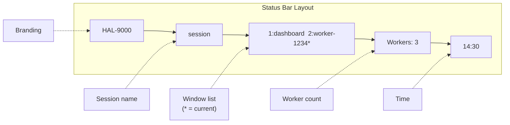

# HAL-9000 tmux Key Bindings

This document describes the keyboard shortcuts available in the HAL-9000 tmux environment.

## Quick Reference Card

> **PREFIX = Ctrl-B** (hold Ctrl, press B, release, then press key)

### Workers

| Key | Action |
|-----|--------|
| `Prefix + w` | Spawn new worker |
| `Prefix + s` | Show status |
| `Prefix + l` | List workers |
| `Prefix + S` | Stop ALL workers (with confirmation) |

### Windows

| Key | Action |
|-----|--------|
| `Prefix + c` | Create new window |
| `Prefix + n` | Next window |
| `Prefix + p` | Previous window |
| `Prefix + 1-9` | Jump to window by number |
| `Prefix + &` | Kill current window |
| `Shift + →` | Next window (no prefix) |
| `Shift + ←` | Previous window (no prefix) |

### Panes

| Key | Action |
|-----|--------|
| `Prefix + \|` | Split horizontally |
| `Prefix + -` | Split vertically |
| `Alt + ←/→/↑/↓` | Navigate panes (no prefix) |
| `Prefix + x` | Kill current pane |
| `Prefix + z` | Toggle pane zoom (fullscreen) |

### Copy Mode

| Key | Action |
|-----|--------|
| `Prefix + [` | Enter copy mode |
| `q` | Exit copy mode |
| `Space` | Start selection |
| `Enter` | Copy selection |
| `Prefix + ]` | Paste |

### Misc

| Key | Action |
|-----|--------|
| `Prefix + d` | Detach from session |
| `Prefix + r` | Reload config |
| `Prefix + ?` | Show all key bindings |

## HAL-9000 Specific Bindings

These bindings are defined in `tmux-dashboard.conf`:

### Worker Management

| Key | Command | Description |
|-----|---------|-------------|
| `Prefix + w` | `/scripts/spawn-worker.sh -d` | Spawn a new worker in background |
| `Prefix + s` | `/scripts/coordinator.sh status` | Show HAL-9000 status overview |
| `Prefix + l` | `/scripts/coordinator.sh list` | List all active workers |
| `Prefix + S` | Stop all workers | Stops all workers (with confirmation) |

### Window Navigation

| Key | Command | Description |
|-----|---------|-------------|
| `Shift + ←` | Previous window | Switch to previous window without prefix |
| `Shift + →` | Next window | Switch to next window without prefix |
| `Prefix + 1-9` | Select window | Jump directly to window number |

### Pane Navigation

| Key | Command | Description |
|-----|---------|-------------|
| `Alt + ←` | Select left pane | Move to pane on left |
| `Alt + →` | Select right pane | Move to pane on right |
| `Alt + ↑` | Select up pane | Move to pane above |
| `Alt + ↓` | Select down pane | Move to pane below |

### Pane Splitting

| Key | Command | Description |
|-----|---------|-------------|
| `Prefix + \|` | Split horizontal | Split pane side-by-side |
| `Prefix + -` | Split vertical | Split pane top/bottom |

## Standard tmux Bindings

These are default tmux bindings that work in HAL-9000:

### Session Management

| Key | Command | Description |
|-----|---------|-------------|
| `Prefix + d` | Detach | Detach from current session |
| `Prefix + $` | Rename session | Rename the current session |
| `Prefix + s` | Session list | Show session selection menu |

### Window Management

| Key | Command | Description |
|-----|---------|-------------|
| `Prefix + c` | New window | Create a new window |
| `Prefix + &` | Kill window | Close current window |
| `Prefix + ,` | Rename window | Rename current window |
| `Prefix + w` | Window list | Show window selection menu |
| `Prefix + n` | Next window | Go to next window |
| `Prefix + p` | Previous window | Go to previous window |
| `Prefix + 0-9` | Select window | Go to window by number |

### Pane Management

| Key | Command | Description |
|-----|---------|-------------|
| `Prefix + %` | Split horizontal | Standard horizontal split |
| `Prefix + "` | Split vertical | Standard vertical split |
| `Prefix + o` | Next pane | Cycle to next pane |
| `Prefix + ;` | Last pane | Switch to last active pane |
| `Prefix + x` | Kill pane | Close current pane |
| `Prefix + z` | Zoom pane | Toggle pane fullscreen |
| `Prefix + {` | Swap pane left | Move pane left |
| `Prefix + }` | Swap pane right | Move pane right |
| `Prefix + Space` | Cycle layouts | Rotate through pane layouts |

### Copy Mode

| Key | Command | Description |
|-----|---------|-------------|
| `Prefix + [` | Enter copy mode | Start scrolling/selection |
| `q` | Exit copy mode | Leave copy mode |
| `Space` | Start selection | Begin text selection |
| `Enter` | Copy selection | Copy selected text |
| `Prefix + ]` | Paste | Paste copied text |
| `g` | Go to top | Jump to beginning of history |
| `G` | Go to bottom | Jump to end of history |
| `/` | Search forward | Search text forward |
| `?` | Search backward | Search text backward |
| `n` | Next match | Go to next search result |
| `N` | Previous match | Go to previous search result |

### Miscellaneous

| Key | Command | Description |
|-----|---------|-------------|
| `Prefix + ?` | Help | Show all key bindings |
| `Prefix + :` | Command prompt | Enter tmux command |
| `Prefix + t` | Show time | Display clock |
| `Prefix + r` | Reload config | Reload tmux configuration |

## Mouse Support

Mouse is enabled in HAL-9000 tmux configuration:

- **Click** on pane to focus it
- **Click** on window in status bar to switch
- **Drag** pane borders to resize
- **Scroll** in pane to enter copy mode and scroll history
- **Click and drag** to select text

## Status Bar

The HAL-9000 status bar shows:



## Common Workflows

### Spawn and Attach to New Worker

```
1. Prefix + w        # Spawn worker
2. Wait 2 seconds
3. Shift + →         # Go to new window (last one)
```

### Monitor Multiple Workers

```
1. Prefix + |        # Split horizontally
2. Prefix + -        # Split vertically
3. In each pane, attach to different worker:
   docker exec -it hal9000-worker-XXX bash
```

### Quick Worker Status Check

```
Prefix + s           # Shows status overlay
```

### Copy Output from Worker

```
1. Prefix + [        # Enter copy mode
2. Navigate with arrow keys
3. Space             # Start selection
4. Move to select text
5. Enter             # Copy
6. Prefix + ]        # Paste
```

### Detach and Reattach

```
# Detach (workers keep running)
Prefix + d

# Reattach later
tmux -L hal9000 attach -t hal9000
```

## Customization

### Changing the Prefix Key

If you prefer a different prefix (e.g., `Ctrl+a`), add to your `~/.tmux.conf`:

```bash
# Change prefix to Ctrl+a
unbind C-b
set -g prefix C-a
bind C-a send-prefix
```

### Adding Custom Bindings

Edit `/scripts/tmux-dashboard.conf` inside the parent container or mount your own config.

Example - Add binding to stop worker under cursor:

```bash
bind k run-shell "docker stop $(tmux display-message -p '#{window_name}')"
```

## Troubleshooting

### Keys Not Working

1. Ensure you're pressing prefix first: `Ctrl+B`, then release, then the key
2. Check if in copy mode (status bar shows `[0/XXX]`) - press `q` to exit
3. Verify config loaded: `Prefix + :` then `source-file /scripts/tmux-dashboard.conf`

### Mouse Not Working

Check mouse mode is enabled:
```bash
Prefix + :
set -g mouse on
```

### Can't Type in Pane

You might be in copy mode. Press `q` to exit.

### Window Disappeared

The worker container may have stopped. Check with:
```bash
docker ps --filter name=hal9000-worker
```
