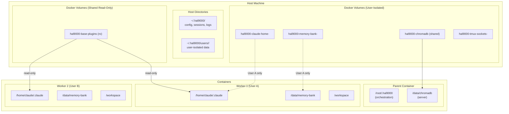
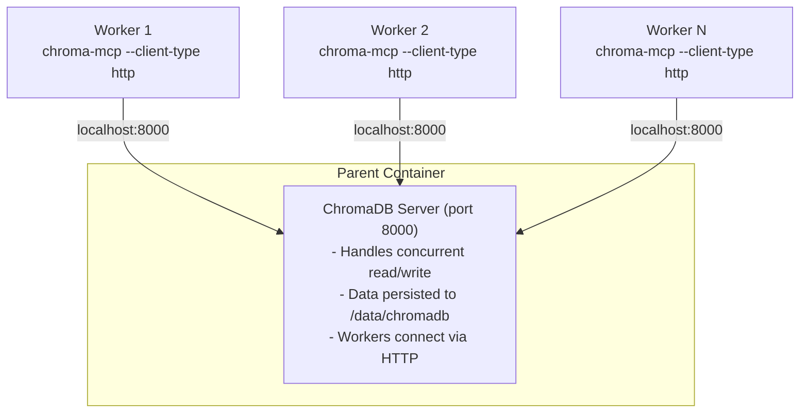

# HAL-9000 Volume Architecture

This document describes the volume and storage architecture for the HAL-9000 Docker-in-Docker system, enabling data sharing between parent and worker containers.

## Security: Per-User Volume Isolation

**IMPORTANT**: As of v3.0.0, all user-facing volumes are isolated per-user to prevent cross-user attacks:
- Malicious plugin installation affecting other users
- Memory bank poisoning across users
- Session state tampering
- Credential theft

Volume naming follows the pattern: `hal9000-<type>-<user_hash>` where `<user_hash>` is an 8-character SHA-256 hash of the username/UID.

## Overview



## Directory Structure

### Host Directories

| Path | Purpose | Mounted To |
|------|---------|------------|
| `~/.hal9000/` | HAL-9000 orchestration state | Parent: `/root/.hal9000` |
| `~/.hal9000/config/` | Configuration files | Parent only |
| `~/.hal9000/sessions/` | Worker session metadata | Parent only |
| `~/.hal9000/logs/` | Orchestration logs | Parent only |
| `~/.hal9000/workers/` | Per-worker Claude configs | Workers: `/root/.claude` |
| `~/.hal9000/chromadb/` | ChromaDB persistent data | All: `/data/chromadb` |
| `~/.hal9000/memory-bank/` | Memory Bank projects | All: `/data/membank` |
| `~/.claude/` | Host Claude configuration | Reference only |

### Docker Named Volumes

#### User-Isolated Volumes (per-user, hash-suffixed)

| Volume Pattern | Purpose | Default Mount |
|----------------|---------|---------------|
| `hal9000-claude-home-<hash>` | User's Claude config, plugins, credentials | `/home/claude/.claude` |
| `hal9000-memory-bank-<hash>` | User's Memory Bank data | `/data/memory-bank` |
| `hal9000-tmux-sockets-<hash>` | User's TMUX sockets | `/data/tmux-sockets` |
| `hal9000-coordinator-state-<hash>` | User's coordinator state | `/data/coordinator-state` |
| `hal9000-claude-session-<hash>` | User's session state | `/root/.claude-session` |

Where `<hash>` is an 8-character SHA-256 hash of the username/UID.

#### Shared Volumes (all users)

| Volume | Purpose | Mount Mode |
|--------|---------|------------|
| `hal9000-chromadb` | Shared ChromaDB storage (tenant-isolated) | read-write |
| `hal9000-base-plugins` | Core plugins (foundation MCP servers) | **read-only** |

## Volume Categories

### 1. Orchestration Volumes (Parent Only)

These volumes are used by the parent container for managing workers:

```bash
# Session metadata
~/.hal9000/sessions/
├── hal9000-worker-1234567890.json
├── hal9000-worker-0987654321.json
└── ...

# Logs
~/.hal9000/logs/
├── parent.log
├── coordinator.log
└── workers/
    ├── worker-1234567890.log
    └── ...

# Configuration
~/.hal9000/config/
├── hal9000.conf
└── defaults/
```

### 2. Shared Data Volumes (All Containers)

These volumes are mounted to both parent and all workers for data sharing:

#### ChromaDB

```bash
# Named volume structure
hal9000-chromadb/
├── chroma.sqlite3           # Main database
├── collections/             # Vector collections
│   ├── research-findings/
│   ├── code-patterns/
│   └── decisions/
└── embeddings/              # Cached embeddings
```

**Mount command:**
```bash
docker run ... -v hal9000-chromadb:/data/chromadb ...
```

#### Memory Bank

```bash
# Named volume structure
hal9000-memorybank/
├── project1/
│   ├── hypotheses.md
│   ├── findings.md
│   └── blockers.md
├── project2_active/
│   └── session.md
└── shared/
    └── cross-project.md
```

**Mount command:**
```bash
docker run ... -v hal9000-memorybank:/data/membank ...
```

### 3. Per-Worker Volumes

Each worker gets its own Claude configuration volume:

```bash
# Per-worker Claude home
hal9000-claude-{worker-name}/
├── .credentials.json        # Auth (copied from host)
├── settings.json            # MCP and preferences
├── agents/                  # Custom agents
├── commands/                # Custom commands
└── projects/                # Project-specific config
```

**Creation in DinD mode:**
```bash
# Named volume (DinD mode)
docker volume create hal9000-claude-$WORKER_NAME
docker run ... -v hal9000-claude-$WORKER_NAME:/root/.claude ...
```

**Creation on host:**
```bash
# Host directory (host mode)
mkdir -p ~/.hal9000/workers/$WORKER_NAME
docker run ... -v ~/.hal9000/workers/$WORKER_NAME:/root/.claude ...
```

### 4. Project Volumes

The project being worked on is mounted at `/workspace`:

```bash
docker run ... -v /path/to/project:/workspace ...
```

## Volume Lifecycle

### Initialization

```bash
# Initialize all volumes
./init-volumes.sh

# Creates:
# - Host directories under ~/.hal9000/
# - Named Docker volumes
# - Default configuration files
```

### Worker Spawn

```bash
# When spawning a worker:
./spawn-worker.sh -n my-worker /path/to/project

# Creates/uses:
# 1. hal9000-claude-my-worker volume (or ~/.hal9000/workers/my-worker/)
# 2. Mounts hal9000-chromadb to /data/chromadb
# 3. Mounts hal9000-memorybank to /data/membank
# 4. Mounts project to /workspace
```

### Cleanup

```bash
# Remove all volumes (destructive!)
./init-volumes.sh --clean

# Remove specific worker volume
docker volume rm hal9000-claude-my-worker
```

## Concurrent Access

### ChromaDB Server Architecture

The parent container runs a ChromaDB HTTP server that all workers connect to:



**Why HTTP client instead of persistent storage?**
- SQLite (persistent mode) has limited concurrent write support
- Multiple workers writing to same SQLite file causes locking issues
- HTTP server handles concurrent access safely
- Workers share network namespace, so localhost:8000 works

```yaml
# MCP server configuration for workers
mcpServers:
  chromadb:
    command: chroma-mcp
    args: ["--client-type", "http", "--host", "localhost", "--port", "8000"]
    env:
      CHROMA_ANONYMIZED_TELEMETRY: "false"
```

**Concurrency notes:**
- Parent runs ChromaDB server, handles all database operations
- Workers connect as HTTP clients (safe concurrent access)
- Server-side locking ensures data integrity
- No file-level conflicts between workers

### Memory Bank

Memory Bank uses file-based storage with project isolation:

```bash
# Each project gets its own directory
/data/membank/
├── project-a/          # Worker 1 working here
├── project-b/          # Worker 2 working here
└── shared/             # Cross-project data
```

**Concurrency notes:**
- Use project-per-worker for isolation
- Shared directory for cross-worker communication
- File-level locking for concurrent edits

## Configuration Integration

### MCP Server Configuration

Workers connect to parent's ChromaDB server via HTTP:

```json
{
  "mcpServers": {
    "chromadb": {
      "command": "chroma-mcp",
      "args": ["--client-type", "http", "--host", "localhost", "--port", "8000"]
    },
    "memory-bank": {
      "command": "npx",
      "args": ["-y", "@allpepper/memory-bank-mcp"],
      "env": {
        "MEMORY_BANK_ROOT": "/data/membank"
      }
    }
  }
}
```

### Environment Variables

| Variable | Default | Description |
|----------|---------|-------------|
| `HAL9000_BASE` | `~/.hal9000` | Base directory for HAL-9000 |
| `CHROMADB_PATH` | `/data/chromadb` | ChromaDB data directory |
| `MEMORYBANK_PATH` | `/data/membank` | Memory Bank root |
| `PLUGINS_PATH` | `/data/plugins` | Marketplace plugins |

## Security Considerations

### Per-User Volume Isolation

As of v3.0.0, volumes are isolated per-user using an 8-character hash of the username/UID:

```bash
# User "alice" gets volumes like:
hal9000-claude-home-a1b2c3d4
hal9000-memory-bank-a1b2c3d4
hal9000-tmux-sockets-a1b2c3d4

# User "bob" gets separate volumes:
hal9000-claude-home-e5f6g7h8
hal9000-memory-bank-e5f6g7h8
hal9000-tmux-sockets-e5f6g7h8
```

This prevents:
- **Malicious plugin attacks**: User A installing malicious plugins that execute in User B's sessions
- **Memory bank poisoning**: User A modifying User B's memory bank to inject false context
- **TMUX hijacking**: User A attaching to or controlling User B's TMUX sessions
- **Credential theft**: User A accessing User B's API keys or auth tokens

### Volume Permissions

```bash
# Host directories should be user-readable
chmod 700 ~/.hal9000
chmod 600 ~/.hal9000/config/hal9000.conf

# User-isolated directories are restricted
chmod 700 ~/.hal9000/users/<hash>/claude
chmod 700 ~/.hal9000/users/<hash>/tmux-sockets
```

### Secrets Management

- API keys stored in secret files, NOT environment variables
- Secret files mounted read-only into containers
- Credentials isolated per-user in separate volumes
- No secrets in shared volumes

### Isolation Layers

1. **User-level**: Each user gets isolated volumes (hash-suffixed)
2. **Worker-level**: Each worker gets its own ChromaDB tenant
3. **Container-level**: Workers run as non-root user 'claude' (UID 1001)
4. **Network-level**: Workers use bridge network (not shared namespace)

## Troubleshooting

### Volume Not Found

```bash
# Check if volume exists
docker volume ls | grep hal9000

# Create missing volumes
./init-volumes.sh
```

### Permission Denied

```bash
# Check ownership
ls -la ~/.hal9000/

# Fix permissions
chmod -R u+rwX ~/.hal9000/
```

### Data Not Syncing

```bash
# Verify mount
docker exec worker-name ls -la /data/chromadb/

# Check volume driver
docker volume inspect hal9000-chromadb
```

### Stale Data in Worker

```bash
# Worker might have cached data
# Restart the worker to get fresh mounts
docker restart worker-name
```

## Best Practices

1. **Use named volumes for DinD mode** - Host paths don't work inside containers
2. **Initialize before first run** - Run `init-volumes.sh` before starting
3. **Project isolation** - Use separate Memory Bank projects per task
4. **Regular backups** - Back up `~/.hal9000/` periodically
5. **Clean unused volumes** - Remove orphaned worker volumes

## Volume Mount Summary

```bash
# User hash is computed from $USER or UID
USER_HASH=$(echo -n "$USER" | sha256sum | cut -c1-8)

# Full worker spawn with user-isolated volumes
docker run -d --rm \
    --name hal9000-worker-$NAME \
    --network bridge \
    -v hal9000-claude-home-$USER_HASH:/home/claude/.claude \
    -v hal9000-memory-bank-$USER_HASH:/data/memory-bank \
    -v hal9000-tmux-sockets-$USER_HASH:/data/tmux-sockets \
    -v hal9000-coordinator-state-$USER_HASH:/data/coordinator-state \
    -v hal9000-base-plugins:/home/claude/.claude/base-plugins:ro \
    -v hal9000-chromadb:/data/chromadb \
    -v /path/to/project:/workspace \
    -v /run/secrets/anthropic_key:/run/secrets/anthropic_key:ro \
    -e CHROMA_TENANT=$NAME \
    -e HAL9000_USER_HASH=$USER_HASH \
    ghcr.io/hellblazer/hal-9000:worker
```

### Volume Isolation Verification

```bash
# Verify user can only see their own volumes
docker volume ls | grep "hal9000.*-$(echo -n "$USER" | sha256sum | cut -c1-8)"

# Check no cross-user volume access
docker exec worker-name ls /data/memory-bank  # Only sees own data
```
