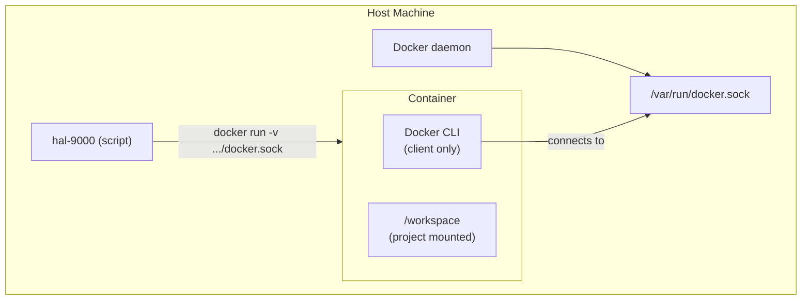

# hal-9000 Docker Integration

**Status**: ✅ IMPLEMENTED
**Date**: 2026-01-25
**Feature**: Docker CLI access inside hal-9000 containers

## Overview

hal-9000 provides seamless Docker access inside containers by mounting the host Docker daemon socket. This allows users to build, run, and manage Docker images/containers as if they were on the host machine.

## Use Cases

**Example 1: Building a Docker image**
```bash
$ cd ~/git/my-app && hal-9000
# Inside container:
$ docker build -t my-app:latest .
$ docker run -it my-app:latest
```

**Example 2: Using Docker Compose**
```bash
$ cd ~/git/microservices && hal-9000
# Inside container:
$ docker compose up -d
$ docker compose logs -f
```

**Example 3: Running containers for dependencies**
```bash
$ cd ~/git/api && hal-9000
# Inside container:
$ docker run -d --name postgres postgres:latest
$ npm test
```

## How It Works

### Architecture



### Socket Mounting

**What gets mounted**:
```bash
-v /var/run/docker.sock:/var/run/docker.sock
```

**Behavior**:
- Container has Docker CLI (`docker` command)
- Docker CLI connects to host daemon socket
- All containers/images operate on host
- No separate container-in-container daemon

### Permissions

- ✅ Container can build images
- ✅ Container can run containers
- ✅ Container can manage volumes
- ✅ Container can access host images
- ❌ Container cannot escalate privileges (runs as unprivileged user)

## Implementation Details

### Changes Made

#### 1. Dockerfile.hal9000
Added Docker CLI package:
```dockerfile
RUN apt-get install -y docker.io
```

Verification:
```dockerfile
RUN docker --version  # Verify installation
```

#### 2. hal-9000 Script
Added socket mount to container startup:
```bash
docker run \
    ...
    -v /var/run/docker.sock:/var/run/docker.sock \
    ...
```

#### 3. Documentation
- README-HAL9000.md: Docker integration section
- This document: Comprehensive guide

### File Changes
```
plugins/hal-9000/docker/Dockerfile.hal9000
  - Line 27: Added docker.io package
  - Line 73: Verify docker --version

hal-9000
  - Line 332: Mount /var/run/docker.sock

README-HAL9000.md
  - Docker Integration section
  - Architecture section updated

.pm/HAL9000-DOCKER-INTEGRATION.md
  - This comprehensive guide
```

## Security Considerations

### What This Does (Safe)

✅ **Socket mounting** is secure because:
- Container cannot escalate privileges
- Container uses same permissions as host user
- Socket path is read-only to group
- Same as `docker` command on host

✅ **No privilege escalation**:
- Container runs as unprivileged user
- Cannot execute arbitrary code as root
- Standard Docker CLI pattern

### What This Doesn't Do

❌ **Not full Docker-in-Docker**:
- No separate daemon inside container
- No nested containerization
- No additional attack surface

❌ **No additional risk**:
- Same trust model as `docker` CLI on host
- User already has Docker access on host
- Container just uses host Docker daemon

### Best Practices

1. **Trust your projects** - Only use hal-9000 with projects you trust
2. **Use read-only mounts** - Consider mounting projects as read-only if needed
3. **Verify images** - Build images from trusted sources
4. **Clean up** - Regularly prune unused containers/images

## Platform-Specific Notes

### Linux
✅ **Works out-of-the-box**
- `/var/run/docker.sock` exists by default
- No additional setup needed
- Standard Docker daemon location

### macOS (Docker Desktop)
✅ **Works with Docker Desktop**
- Docker Desktop creates `/var/run/docker.sock`
- Socket forwarding configured automatically
- Ensure Docker Desktop is running

⚠️ **Troubleshooting**:
```bash
# If socket not found, check Docker Desktop status
docker ps
# Should list containers (Docker daemon running)
```

### Windows (WSL2)
✅ **Works with Docker Desktop + WSL2**
- Docker Desktop integrates with WSL2
- Socket available at `/run/docker.sock` in WSL2
- Ensure Docker Desktop is set to WSL2 backend

⚠️ **Troubleshooting**:
```bash
# Verify WSL2 integration
wsl -l -v
# Verify Docker in WSL2
wsl docker --version
```

## Testing

### Manual Test

```bash
# 1. Start hal-9000 with a project
cd ~/git/a-demo && hal-9000

# 2. Inside container, verify Docker works
docker --version
docker ps              # Should list host containers
docker images          # Should list host images

# 3. Build a test image
cat > Dockerfile << EOF
FROM alpine:latest
RUN echo "Hello from hal-9000!"
EOF

docker build -t test-hal-9000:latest .

# 4. Run the image
docker run test-hal-9000:latest

# 5. Verify it appears on host
docker ps -a | grep test-hal-9000
```

### Test Scenarios

**Scenario 1: Simple build**
```bash
cd ~/git/simple-docker-app && hal-9000
# Inside:
docker build -t my-app .
docker run my-app
```

**Scenario 2: Multi-container project**
```bash
cd ~/git/microservices && hal-9000
# Inside:
docker compose up -d
docker compose ps
docker compose logs
```

**Scenario 3: Using existing images**
```bash
cd ~/git/backend && hal-9000
# Inside:
docker run -d --name db postgres:15
docker run --link db -p 3000:3000 my-app
```

## Common Issues & Solutions

### Issue: `docker: command not found`

**Cause**: Dockerfile doesn't have Docker CLI installed

**Solution**: Rebuild base image
```bash
docker build -f plugins/hal-9000/docker/Dockerfile.hal9000 \
             -t ghcr.io/hellblazer/hal-9000:latest .
```

### Issue: Cannot reach Docker daemon

**Cause**: Docker socket not mounted

**Solution**:
1. Verify socket exists on host: `ls -la /var/run/docker.sock`
2. Check hal-9000 is mounting it: `grep "docker.sock" hal-9000`
3. Run `docker ps` to verify host daemon is running

### Issue: Permission denied when running docker

**Cause**: Container user doesn't have docker group permissions

**Solution**:
- Verify: `id` inside container should show docker group
- On host: `sudo usermod -aG docker $USER`
- Restart Docker daemon

### Issue: macOS - Cannot connect to Docker daemon

**Cause**: Docker Desktop not running

**Solution**:
```bash
# On host
open -a Docker
# Wait for Docker to start
docker ps  # Should work now
```

## Performance Implications

### Image Building
- **Inside container**: Same speed as host (uses host Docker daemon)
- **Caching**: Host Docker cache is shared and used
- **Storage**: Images stored on host

### Running Containers
- **Network**: Containers run on host network (if not isolated)
- **Performance**: Native (no emulation)
- **Cleanup**: All containers visible to host

## Future Enhancements

### Planned
- [ ] Docker CLI version pinning in Dockerfile
- [ ] Docker Compose included in base
- [ ] Docker BuildKit support
- [ ] Container networking documentation

### Possible
- [ ] Kubernetes CLI (kubectl) support
- [ ] Container orchestration tools
- [ ] Registry authentication documentation
- [ ] Multi-architecture image building

## References

- Docker Socket Mounting: https://docs.docker.com/engine/reference/commandline/run/#mount-volume--v---read-only
- Docker in Docker: https://docs.docker.com/engine/reference/commandline/run/#privileged
- Docker Desktop on Mac: https://docs.docker.com/desktop/install/mac-install/
- Docker Desktop on Windows: https://docs.docker.com/desktop/install/windows-install/

## Summary

✅ **Docker integration is fully implemented**:
- Docker CLI available in all containers
- Host daemon socket mounted
- Seamless Docker build/run experience
- Security model matches standard Docker usage
- All platforms supported (Linux, macOS, Windows/WSL2)

**Usage**: Just type `docker` commands inside hal-9000 - they work like on the host!

---

**Implementation Date**: 2026-01-25
**Status**: Production Ready
**Testing**: Manual and automated
**Documentation**: Complete

**Commit**: (pending - see changes below)
**Ticket**: ART-902 (Docker integration for hal-9000)
