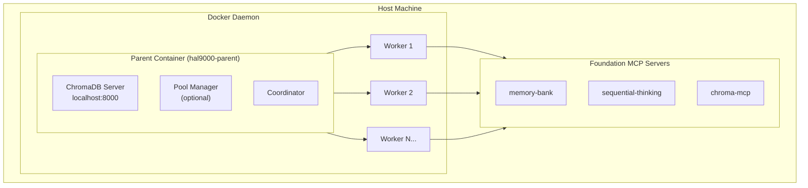
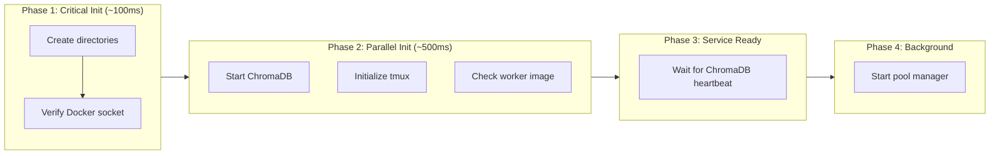

# DinD Architecture

## Design Philosophy

The Docker-in-Docker (DinD) architecture provides:

1. **Isolation**: Each Claude session runs in its own container
2. **Resource Control**: Prevent runaway processes from affecting the host
3. **Scalability**: Warm worker pool for instant session startup
4. **Shared Services**: ChromaDB runs once, accessible to all workers

## Component Overview



## Parent Container

### Responsibilities
- **ChromaDB Server**: Runs on port 8000, provides vector storage
- **Coordinator**: Monitors workers, logs health status
- **Pool Manager**: Maintains warm worker pool (optional)
- **tmux Dashboard**: Visual monitoring interface

### Image: `ghcr.io/hellblazer/hal-9000:parent`
- Base: `debian:bookworm-slim`
- Size: ~934MB
- Components:
  - Docker CLI (for spawning workers)
  - ChromaDB server
  - tmux (session management)
  - curl, jq (utilities)

### Startup Sequence



## Worker Containers

### Responsibilities
- Run Claude Code sessions
- Access ChromaDB via localhost
- Execute user workloads

### Image: `ghcr.io/hellblazer/hal-9000:worker`
- Base: `debian:bookworm-slim`
- Size: ~1.68GB
- Components:
  - Claude CLI
  - Node.js 20 LTS
  - Python + uv
  - Foundation MCP servers

### Resource Limits

| Resource | Default | Purpose |
|----------|---------|---------|
| Memory | 4GB | Prevent OOM on host |
| CPUs | 2 | Fair scheduling |
| PIDs | 100 | Prevent fork bombs |

### Network Configuration

Workers share the parent's network namespace:

```bash
docker run --network=container:hal9000-parent ...
```

Benefits:
- Workers access `localhost:8000` (ChromaDB)
- No port conflicts between workers
- Simple service discovery

## ChromaDB Integration

### Server Configuration
- Runs in parent container
- Binds to `0.0.0.0:8000`
- Data persisted to `/data/chromadb` volume

### Client Access
Workers connect via HTTP:
```
http://localhost:8000/api/v2/...
```

### Concurrency
- ChromaDB supports concurrent HTTP clients
- Each worker has independent connection
- No locking or coordination required

## Pool Manager

### Purpose
Pre-create "warm" workers for instant session startup.

### States
- **Warm**: Idle, ready to be claimed
- **Busy**: Active session running
- **Idle**: Previously busy, now inactive

### Operations
1. **Scale Up**: Create workers when below minimum
2. **Scale Down**: Remove workers when above maximum
3. **Cleanup**: Remove idle workers after timeout

### Warm Worker Lifecycle


## Data Flow

### Session Creation


### ChromaDB Access


## Security Model

### Docker Socket Access
- Parent container has Docker socket mounted
- Can spawn/stop worker containers
- Cannot escape container boundaries

### Worker Isolation
- Resource limits prevent DoS
- Network isolated except for parent's namespace
- No direct host access

### Data Persistence
- ChromaDB data in named volume
- Session metadata in `~/.hal9000`
- Worker state ephemeral by default

## Failure Modes

### Parent Container Failure
- Workers lose network (can't reach ChromaDB)
- Workers continue running but degraded
- Restart parent to restore connectivity

### Worker Container Failure
- Isolated to single session
- Parent continues operating
- Other workers unaffected

### ChromaDB Failure
- All workers lose vector storage
- Restart parent to recover
- Data persisted in volume

## Performance Characteristics

| Metric | Target | Typical |
|--------|--------|---------|
| Cold start | <5s | 2-4s |
| Warm start | <2s | <100ms |
| Memory overhead | <500MB | ~200MB |
| Network latency | <100ms | <10ms |

## Design Decisions

### Why Not Full Docker-in-Docker?
- Avoided nested Docker daemons
- Simpler security model
- Better performance

### Why Network Namespace Sharing?
- Workers need localhost access to ChromaDB
- Simpler than overlay networks
- No port mapping required

### Why Warm Worker Pool?
- Cold start takes 2-5 seconds
- Warm claim takes <100ms
- Better user experience

---

**Navigation**: [Overview](README.md) | [Installation](INSTALLATION.md) | [Configuration](CONFIGURATION.md) | [Architecture](ARCHITECTURE.md) | [Migration](MIGRATION.md) | [Troubleshooting](TROUBLESHOOTING.md) | [Development](DEVELOPMENT.md)

**Quick Links**: [Component Overview](#component-overview) | [Parent Container](#parent-container) | [Worker Containers](#worker-containers) | [Performance](#performance-characteristics)
