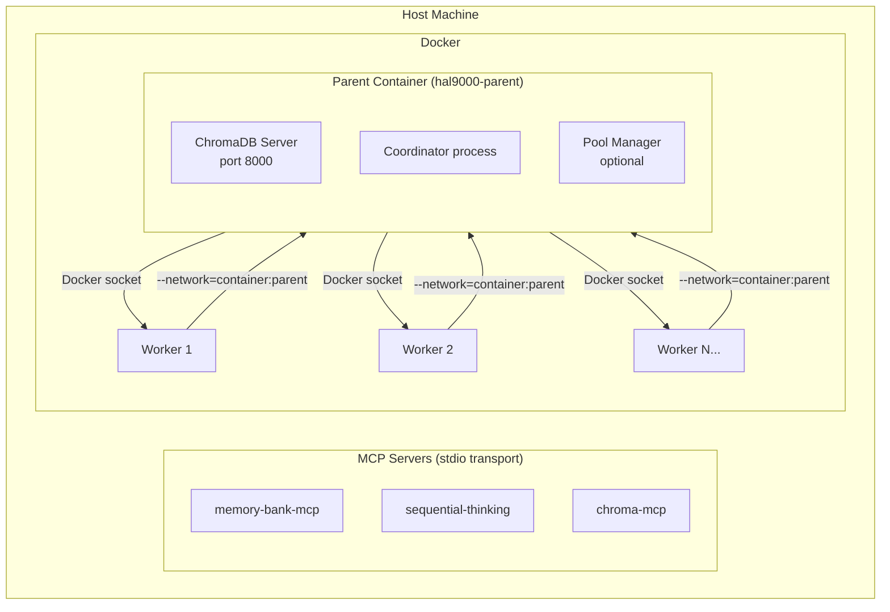

# HAL-9000 Docker-in-Docker (DinD) - Complete Documentation

## Overview

The DinD architecture provides isolated Claude Code environments running in Docker containers, with a parent container orchestrating multiple worker containers.

**Key Benefits:**
- **Isolation**: Each Claude session runs in its own container
- **Resource Control**: CPU, memory, and process limits per worker
- **Scalability**: Warm worker pool for instant session startup
- **Shared Services**: ChromaDB runs in parent, accessible to all workers

## Quick Start

```bash
# Start the daemon (parent container + ChromaDB)
claudy daemon start

# Spawn a worker for your project
claudy --via-parent /path/to/project

# Check status
claudy daemon status
```

## Documentation

| Document | Description |
|----------|-------------|
| [Installation](INSTALLATION.md) | Setup and prerequisites |
| [Configuration](CONFIGURATION.md) | Environment variables and options |
| [Architecture](ARCHITECTURE.md) | Technical design and component details |
| [Migration](MIGRATION.md) | Upgrading from single-container mode |
| [Development](DEVELOPMENT.md) | Contributing and extending |

## Architecture Diagram



## Key Concepts

### Parent Container
- Runs ChromaDB server for shared vector storage
- Manages worker lifecycle
- Provides network namespace for workers
- Optional warm worker pool

### Worker Containers
- Lightweight (~500MB)
- Share parent's network (localhost access)
- Resource-limited (4GB memory, 2 CPUs, 100 processes)
- Run Claude Code sessions

### Claudy CLI
- `claudy daemon start/stop/status` - Manage parent container
- `claudy --via-parent` - Spawn worker through parent
- `claudy pool start/status` - Manage warm worker pool

## Requirements

- Docker 20.10+
- claudy v0.6.0+
- 8GB+ RAM recommended
- Docker socket access

## Support

For issues and troubleshooting, see:
- [Troubleshooting Guide](TROUBLESHOOTING.md)
- [GitHub Issues](https://github.com/Hellblazer/hal-9000/issues)

---

**Navigation**: [Overview](README.md) | [Installation](INSTALLATION.md) | [Configuration](CONFIGURATION.md) | [Architecture](ARCHITECTURE.md) | [Migration](MIGRATION.md) | [Troubleshooting](TROUBLESHOOTING.md) | [Development](DEVELOPMENT.md)

**Quick Links**: [Key Concepts](#key-concepts) | [Requirements](#requirements)
