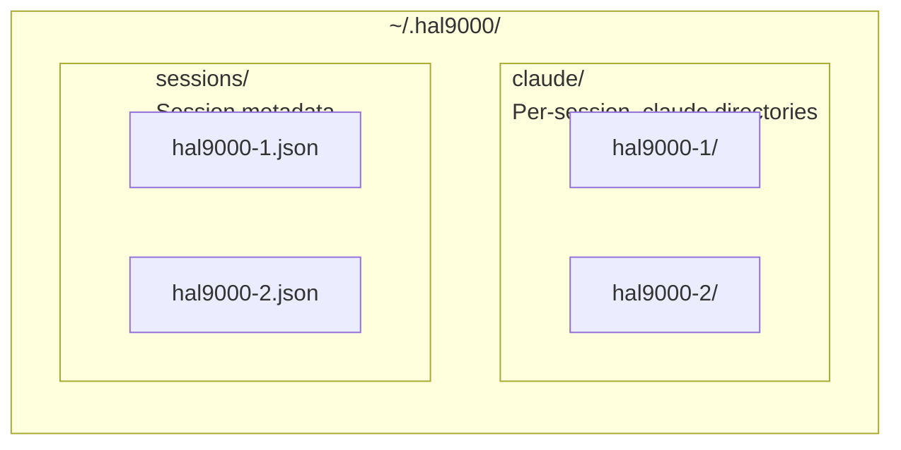

# hal9000 - Containerized Claude with Full hal-9000 Stack

Launch Docker containers with the complete hal-9000 experience: MCP servers, agents, and tools pre-installed.

## Quick Start

```bash
# Single container in current directory
hal9000 run

# With Python profile
hal9000 run --profile python

# Multiple sessions
hal9000 squad --sessions 3

# From config file
hal9000 squad tasks.conf
```

## Commands

| Command | Description |
|---------|-------------|
| `hal9000 run` | Launch single container |
| `hal9000 squad` | Launch multiple sessions |
| `hal9000-list` | List active sessions |
| `hal9000-attach <session>` | Attach to session |
| `hal9000-stop <session>` | Stop specific session |
| `hal9000-send <session> "cmd"` | Send command to session |
| `hal9000-broadcast "cmd"` | Send to all sessions |
| `hal9000-cleanup` | Stop all sessions |

## hal9000 run

Launch a single container:

```bash
hal9000 run [OPTIONS] [DIRECTORY]

Options:
  --profile PROFILE    Profile: python, node, java (default: base)
  --slot N             Use specific slot number
  --name NAME          Custom session name
  --detach, -d         Don't attach after launch
```

Examples:
```bash
hal9000 run                          # Current dir, base image
hal9000 run --profile python         # Python development
hal9000 run ~/projects/myapp         # Specific directory
hal9000 run --name myproject -d      # Named, detached
```

## hal9000 squad

Launch multiple sessions for parallel work:

```bash
# Launch N identical sessions
hal9000 squad --sessions 3
hal9000 squad --sessions 4 --profile python

# Launch from config file
hal9000 squad tasks.conf
```

### Config File Format

```
name:profile:description
```

Example `tasks.conf`:
```
api-dev:node:API development
ml-work:python:ML experiments
backend:java:Backend services
```

## What's Inside Each Container

- **Claude CLI** - Full Claude Code experience
- **MCP Servers** (pre-configured):
  - `memory-bank` - Persistent memory
  - `sequential-thinking` - Step-by-step reasoning
  - `chromadb` - Vector database
- **Tools**:
  - `tmux-cli` - Interactive CLI control
  - `vault` - Encrypted .env backup
  - `env-safe` - Safe .env inspection
- **Your agents** - Copied from `~/.claude/agents/`

## Session Coordination

From any terminal:
```bash
# Send to specific session
hal9000-send hal9000-1 "git status"

# Send to all sessions
hal9000-broadcast "npm install"

# Check status
hal9000-list
```

From inside a container:
```bash
# See other sessions in CLAUDE.md
cat .hal9000-session.md
```

## Directory Structure



## Environment Variables

Pass through automatically:
- `ANTHROPIC_API_KEY` - Required for Claude
- `CHROMADB_TENANT` - For ChromaDB cloud mode
- `CHROMADB_DATABASE`
- `CHROMADB_API_KEY`

## vs aod

| Feature | hal9000 | aod |
|---------|---------|-----|
| Container launch | ✓ | ✓ |
| MCP servers | ✓ | ✓ |
| Multi-session | ✓ | ✓ |
| tmux integration | ✓ | ✓ |
| Git worktrees | ✗ | ✓ |
| Branch isolation | ✗ | ✓ |

**Use hal9000** for: General containerized development, parallel tasks on same codebase

**Use aod** for: Multi-branch development, feature isolation, parallel PR work

## Troubleshooting

**Container won't start:**
```bash
# Check Docker is running
docker ps

# Check for port conflicts
docker ps --filter "name=hal9000"

# Manual cleanup
hal9000-cleanup --force
```

**MCP servers not working:**
- Check `~/.hal9000/claude/<session>/settings.json`
- Verify `ANTHROPIC_API_KEY` is set

**Session not found:**
```bash
# List all sessions
hal9000-list

# Check tmux directly
tmux list-sessions | grep hal9000
```
