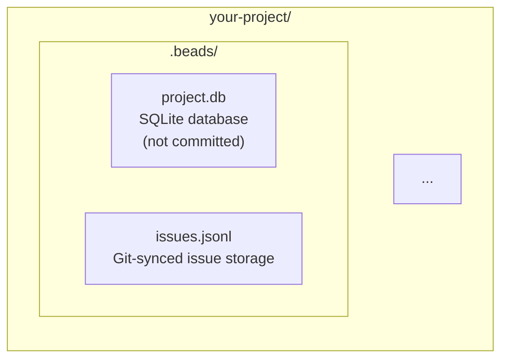

# Beads (bd) Issue Tracker

AI-optimized issue tracker with first-class dependency support. "Issues chained together like beads."

## Features

- Dependency-aware issue tracking (blockers, related, parent-child)
- Git-friendly auto-sync (JSONL format, automatic export/import)
- AI-optimized workflow (JSON output, ready work detection)
- Integrations (Jira, Linear, GitHub)
- CLI-first design for Claude Code

## Use Cases

- Track tasks with complex dependencies
- Prevent duplicate work through dependency chains
- AI-supervised coding workflows
- Multi-agent task coordination
- Replace markdown TODO lists with structured tracking

## Installation

Run the installation script (or use hal-9000 main installer):

```bash
# Via Homebrew (recommended)
brew tap steveyegge/beads
brew install bd

# Or via curl
curl -fsSL https://raw.githubusercontent.com/steveyegge/beads/main/scripts/install.sh | bash
```

## Quick Start

```bash
# Initialize beads in your project
cd your-project
bd init

# Create your first issue
bd create "Implement login feature" -t feature -p 1

# View ready work (unblocked issues)
bd ready

# Get Claude Code integration instructions
bd onboard
```

## Configuration

The bd CLI auto-discovers your beads database:
1. `.beads/*.db` in current directory or ancestors
2. `$BEADS_DB` environment variable
3. `$BEADS_DIR` environment variable
4. `~/.beads/default.db` as fallback

## CLI Commands

Essential commands:

```bash
# View issues
bd list                    # All issues
bd ready                   # Ready to work (no blockers)
bd blocked                 # Blocked issues
bd show <id>               # Issue details

# Manage issues
bd create "Title" -t type -p priority
bd update <id> --status in_progress
bd close <id> --reason "Done"

# Dependencies
bd dep add <id> <blocker-id>   # Add dependency
bd dep tree <id>               # View dependency tree

# Epics
bd epic create "Epic title"
bd create "Subtask" --parent <epic-id>

# Sync
bd sync                    # Force immediate git sync
```

## Issue Types

- `bug` - Something broken
- `feature` - New functionality
- `task` - Work item (tests, docs, refactoring)
- `epic` - Large feature with subtasks
- `chore` - Maintenance (dependencies, tooling)

## Priority Levels

- `0` - Critical (security, data loss, broken builds)
- `1` - High (major features, important bugs)
- `2` - Medium (default, nice-to-have)
- `3` - Low (polish, optimization)
- `4` - Backlog (future ideas)

## AI Agent Workflow

Recommended workflow for Claude Code:

1. **Check ready work**: `bd ready --json`
2. **Claim task**: `bd update <id> --status in_progress --json`
3. **Work on it**: Implement, test, document
4. **Discover new work?**: `bd create "Found bug" -p 1 --deps discovered-from:<parent-id> --json`
5. **Complete**: `bd close <id> --reason "Done" --json`
6. **Commit together**: Always commit `.beads/issues.jsonl` with code changes

## Database Structure



## Git Integration

Beads auto-syncs with git:
- Exports to JSONL after changes (5s debounce)
- Imports from JSONL when newer (after git pull)
- Install git hooks: `bd hooks install`

## Stealth Mode

For personal use without affecting repo collaborators:

```bash
bd init --stealth
```

This configures global gitignore and Claude settings to keep beads invisible.

## Prerequisites

- macOS or Linux
- Homebrew (for macOS) or curl

## Troubleshooting

### No beads database found

Initialize beads in your project:
```bash
cd your-project
bd init
```

### Sync issues

Force a manual sync:
```bash
bd sync
```

Check database status:
```bash
bd info
```

## Links

- [Beads GitHub](https://github.com/steveyegge/beads)
- [bd CLI Reference](https://github.com/steveyegge/beads/blob/main/docs/CLI_REFERENCE.md)
